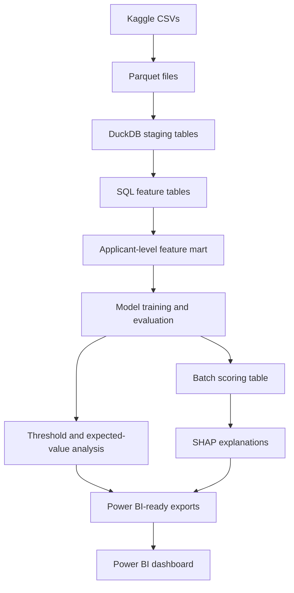

# Loan Default Risk Decisioning System

> End-to-end financial decision-support project for loan default risk: SQL feature engineering, LightGBM modeling, SHAP explainability, batch scoring, threshold analysis, and Power BI reporting.

## Overview

This project simulates a financial-services decision-support workflow. It converts public loan-application data into applicant-level risk-ranking scores, evaluates ranking, calibration, and threshold behavior on labeled holdout data, assigns applicants to risk-based action bands, writes batch predictions to DuckDB, and visualizes threshold tradeoffs in Power BI.

The goal is not production underwriting. The goal is to show an applied ML engineering workflow that connects data contracts, feature engineering, model validation, business thresholds, explainability, and dashboard-ready outputs.

## Business Question

Which applicants are most likely to experience repayment difficulty, and how should score thresholds be set to balance approval rate, default capture, manual review workload, and illustrative portfolio value?

## Architecture



## Dataset

Primary dataset: Home Credit Default Risk public Kaggle dataset.

The model predicts:

```text
TARGET = 1: applicant experienced repayment difficulty
TARGET = 0: applicant did not experience observed repayment difficulty
```

v1 uses these source files:

- `application_train.csv`
- `application_test.csv`
- `bureau.csv`
- `previous_application.csv`
- `installments_payments.csv`

Kaggle `application_test` rows are scored for production-like demonstration only. They are not used for validation metrics because they do not include labels.

## Stack

| Layer | Tools |
|---|---|
| Storage | Parquet |
| Database | DuckDB |
| Feature engineering | SQL |
| Modeling | Python, pandas, scikit-learn, LightGBM |
| Evaluation | scikit-learn |
| Explainability | SHAP |
| Testing | pytest, ruff |
| Reproducibility | Makefile, Dockerfile |
| Reporting | Power BI |

## Modeling Approach

The project trains a logistic regression baseline and a tuned LightGBM primary model. The LightGBM search is intentionally bounded: it compares a small set of prior-informed candidates using validation-only selection, with PR-AUC as the main ranking metric and lift, recall-at-review-capacity, ROC-AUC, Brier score, and non-degenerate score distribution as guardrails.

v1 scores are not fitted calibrated default probabilities. The project evaluates probability quality with Brier score and calibration bins, but no Platt/sigmoid or isotonic calibration layer is fitted in v1. Treat score thresholds as validation-derived ranking cutoffs, not as literal default-probability policy thresholds.

Post-v1 adds a separate sigmoid calibration artifact for the 168-feature LightGBM model. This is one of the strongest post-v1 improvements: held-out test Brier score improves from `0.173301` to `0.066460`, and weighted calibration-bin error improves from `0.288304` to `0.002709` without changing rank metrics.

| Post-v1 calibration result | Uncalibrated | Sigmoid calibrated | Difference |
|---|---:|---:|---:|
| Validation Brier score | 0.174335 | 0.066500 | -0.107835 |
| Test Brier score | 0.173301 | 0.066460 | -0.106842 |
| Validation weighted bin error | 0.289885 | 0.003634 | -0.286251 |
| Test weighted bin error | 0.288304 | 0.002709 | -0.285595 |

Batch scoring and dashboard exports keep the original rank score as `score` / `raw_risk_score` and add `calibrated_risk_score` plus `calibration_method`. This preserves the existing threshold-policy audit trail while making calibrated score quality visible downstream.

Post-v1 feature experiments are tracked under `reports/experiments/`. The current fully supported evidence promotes the 168-feature last-k temporal model as the leading post-v1 ranking/calibration/business-value candidate. The concise recruiter-facing version of that trail is documented in `reports/experiments/v1_to_post_v1_model_diff.md`.

The learning loop was deliberate: add richer monthly repayment history, fix calibration honestly, test stability across seeds, explore recency and last-k repayment behavior, then run cleanup to see whether a smaller surface could keep the gains. Smaller SHAP-ranked surfaces did not beat the full 168-feature setup on repeated-seed validation aggregates, so the project stops feature expansion here.

Accuracy is not used as the headline metric because repayment difficulty is an imbalanced outcome.

## Frozen V1 Model Results

Selected v1 model: `lightgbm` (`lightgbm_credit_risk_v1`).

| Split | PR-AUC | ROC-AUC | Brier | Top-decile lift | Recall at 10% review capacity |
|---|---:|---:|---:|---:|---:|
| Validation | 0.260173 | 0.770420 | 0.171640 | 3.490643 | 0.349087 |
| Held-out test | 0.258236 | 0.770385 | 0.171245 | 3.482588 | 0.348281 |

Validation comparison against the logistic regression baseline:

| Metric | Logistic regression | LightGBM | Difference |
|---|---:|---:|---:|
| PR-AUC | 0.244617 | 0.260173 | +0.015556 |
| ROC-AUC | 0.757608 | 0.770420 | +0.012812 |
| Brier score | 0.200474 | 0.171640 | -0.028835 |
| Top-decile lift | 3.337592 | 3.490643 | +0.153051 |
| Recall at 10% review capacity | 0.333781 | 0.349087 | +0.015306 |

## Post-v1 Improvement Summary

The best post-v1 candidate is the 168-feature last-k temporal LightGBM setup with sigmoid calibration. It is documented as an experimental portfolio improvement over the frozen v1 baseline, not as production underwriting readiness.

| Metric | Frozen v1 | Best post-v1 | Difference |
|---|---:|---:|---:|
| Feature count | 68 | 168 | +100 |
| Validation PR-AUC | 0.260173 | 0.272184 | +0.012011 |
| Validation ROC-AUC | 0.770420 | 0.778732 | +0.008312 |
| Validation Brier score | 0.171640 | 0.066500 | -0.105139 |
| Validation top-decile lift | 3.490643 | 3.659805 | +0.169162 |
| Validation recall at 10% review capacity | 0.349087 | 0.366004 | +0.016917 |
| Validation balanced EV / applicant | 571.52 | 577.24 | +5.72 |

The biggest lesson was not "more features always win." The experiment trail showed that calibration gave the cleanest probability-quality gain, recent repayment behavior was the strongest feature-engineering direction, and cleanup did not justify dropping the final 16 features. Held-out test remains a post-selection generalization check, not the optimization target.

## Decision Policy

Model scores are converted into simulated business actions:

| Score range | Risk band | Simulated action |
|---:|---|---|
| `< T_low` | Low risk | Approve |
| `T_low` to `< T_high` | Medium risk | Manual review |
| `>= T_high` | High risk | Decline or high-priority review |

Thresholds are selected using validation-set scores and explicit business assumptions. The selected balanced scenario uses:

These thresholds are score cutoffs from the selected uncalibrated model. They are useful for comparing rank-based action policies in this portfolio simulation, but they should not be read as calibrated probability-of-default cutoffs.

| Scenario | `T_low` | `T_high` | Test approval rate | Test review rate | Test high-risk rate | Test EV / applicant |
|---|---:|---:|---:|---:|---:|---:|
| Balanced | 0.580982 | 0.695323 | 0.8010 | 0.0967 | 0.1023 | 572.03 |

## Expected-Value Framework

```text
Expected value =
    approved_good_count * expected_margin_per_good_loan
  - approved_bad_count * expected_loss_per_bad_loan
  - manual_review_count * manual_review_cost
```

Scenario assumptions:

| Assumption | Value |
|---|---:|
| Expected margin per good approved loan | 1000 |
| Expected loss per bad approved loan | 5000 |
| Manual review cost | 50 |
| Manual review capacity | 10% of applicants |

These are illustrative assumptions used to compare threshold behavior. They are not real Home Credit economics.

Interpretation: the `1000` margin and `5000` loss values are utility weights for comparing scenarios, not calibrated loan-level profit and loss estimates. They intentionally encode that approving a bad loan is much more costly than approving a good loan is valuable, while keeping the v1 dashboard readable. A production-style value model would scale margin and loss by exposure, term, pricing, funding cost, recovery, and loss-given-default assumptions.

## Power BI Dashboard

The dashboard summarizes the decisioning workflow with KPI cards, score distribution, threshold scenario comparison, risk-band action mix, expected-value behavior, lift/calibration validation, and top model drivers.


Power BI consumes CSV exports from `reports/dashboard_data/`, which are generated from the explicit v1 config by `make pipeline-v1` or, after upstream v1 artifacts already exist, `make dashboard-data`. The v1 dashboard bundle remains raw and uncalibrated, with the selected model labeled `lightgbm_credit_risk_v1`. For post-v1 comparison work, `make pipeline-post-v1` rebuilds the improved pipeline from `configs/post_v1.yaml` and writes the same filenames and schemas to `reports/dashboard_data_post_v1/`. The post-v1 bundle labels the improved selected model as `lightgbm_credit_risk_post_v1`, uses calibrated probabilities for Brier, calibration bins, and segment probability-quality diagnostics, and preserves raw rank scores for threshold-policy views. The duplicated Power BI report can then be repointed with only a source-folder change.

## Key Outputs

| Artifact | Purpose |
|---|---|
| `mart_credit_risk_features` | One-row-per-applicant feature mart |
| `models/v1/` | Frozen v1 model artifacts |
| `models/post_v1/` | Frozen best post-v1 model artifacts |
| `reports/v1/model_metrics_summary.csv` | Frozen v1 model metrics by split |
| `reports/post_v1/model_metrics_summary.csv` | Frozen post-v1 model metrics by split |
| `reports/v1/lightgbm_tuning_summary.csv` | Frozen v1 LightGBM candidate comparison |
| `reports/post_v1/lightgbm_tuning_summary.csv` | Frozen post-v1 LightGBM candidate comparison |
| `reports/v1/model_threshold_metrics.csv` | Frozen v1 threshold scenario metrics |
| `reports/post_v1/model_threshold_metrics.csv` | Frozen post-v1 threshold scenario metrics |
| `reports/v1/model_feature_importance.csv` | Frozen v1 SHAP global feature importance |
| `reports/post_v1/model_feature_importance.csv` | Frozen post-v1 SHAP global feature importance |
| `reports/model_card.md` | Intended use, limitations, and validation summary |
| `reports/experiments/` | Post-v1 experiment reports and comparison log |
| `reports/experiments/v1_to_post_v1_model_diff.md` | Recruiter-friendly v1 to best post-v1 improvement summary |
| `configs/v1.yaml` | Reproducible frozen-v1 pipeline scope |
| `configs/post_v1.yaml` | Reproducible best post-v1 pipeline scope |
| `reports/dashboard_data/` | Power BI-ready export tables |
| `reports/dashboard_data_post_v1/` | Same-schema Power BI export tables for the best post-v1 candidate |
| `powerbi/screenshots/` | Dashboard screenshots |

## Top Model Drivers

The top SHAP-ranked drivers include external source aggregates, prior application amount ratios, requested credit/goods amounts, employment length, payment delay behavior, and repayment-history features. SHAP outputs are used for model interpretation and debugging only; they are not legally compliant adverse-action notices.

## How to Run

```bash
make setup
make ingest
make features
make train
make evaluate
make score
make dashboard-data
make dashboard-data-post-v1
make test
```

To rebuild the two dashboard comparison bundles from current code without relying on old commits:

```bash
make pipeline-v1
make pipeline-post-v1
```

Raw Kaggle data is not committed. Download the dataset separately and place the CSV files in `data/raw/`.

## Repository Structure

```text
loan-default-risk-decisioning-system/
|-- README.md
|-- PROJECT_SPEC.md
|-- IMPLEMENTATION_PLAN.md
|-- TESTING_PLAN.md
|-- VALIDATION_PLAN.md
|-- Makefile
|-- Dockerfile
|-- requirements.txt
|-- configs/
|-- data/
|-- docs/
|-- models/
|-- notebooks/
|-- powerbi/
|-- reports/
|-- sql/
|-- src/
`-- tests/
```

## Limitations

This is a portfolio decision-support simulation, not an automated underwriting system.

The target is a proxy for observed repayment difficulty, not a complete loss/default framework. Expected value is illustrative and depends on simplified assumptions. The model is validated on a static public dataset and does not include production monitoring, adverse-action controls, fair-lending review, compliance approval, or model governance.

Direct demographic and protected-status-like fields are excluded from v1 model features. If age, gender, marital status, or family-status-like fields are inspected, they are retained only in a separate diagnostic layer for limitation checks, not model training or deployment approval.

Post-v1 experiments have added richer monthly history tables such as `bureau_balance`, `POS_CASH_balance`, and `credit_card_balance`, plus recency and last-k temporal feature candidates. Cleanup experiments did not justify a smaller promoted surface, so the active post-v1 candidate remains the 168-feature last-k temporal model. Deeper monitoring remains future work outside the v1 scope.
