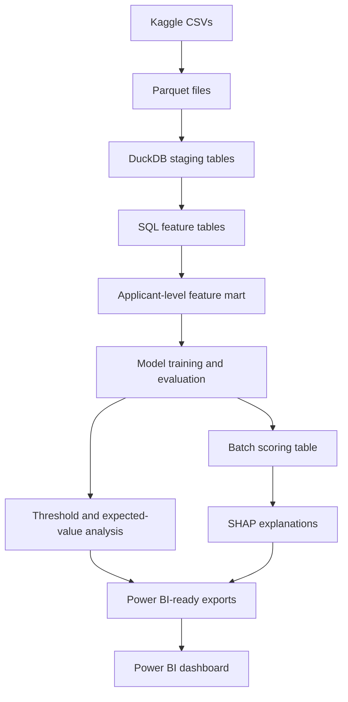

# Loan Default Risk Decisioning System

End-to-end credit-risk decision-support project using public Home Credit data, SQL feature engineering, LightGBM modeling, validation-driven threshold analysis, SHAP explainability, batch scoring, and Power BI reporting.

This is a portfolio project, not a production underwriting system. The goal is to show how I would turn messy relational credit data into a reproducible analytics and ML workflow that supports risk ranking, business tradeoff analysis, and dashboard-ready reporting.

## Outcome At A Glance

Built a complete credit-risk decision-support workflow: raw public Kaggle CSVs become a DuckDB feature mart, trained LightGBM models, validation-driven threshold scenarios, scored applicant tables, SHAP interpretation outputs, and Power BI dashboard exports.

The frozen v1 pipeline is complete and reproducible. Post-v1 experiments promoted a calibrated 168-feature LightGBM candidate that improves held-out test PR-AUC from `0.258236` to `0.269925`, Brier score from `0.171245` to `0.066460`, and balanced expected value per applicant from `572.03` to `581.58`.

## Two-Minute Review Path

1. Review the dashboard screenshots below for the business-facing output.
2. Scan the Key Results section for model and decisioning outcomes.
3. Read [V1 to Best Post-v1 Model Diff](reports/experiments/v1_to_post_v1_model_diff.md) for the experiment story and final tradeoffs.

## Project Snapshot

| Area | Summary |
|---|---|
| Business problem | Rank loan applicants by repayment-difficulty risk and translate scores into simulated approve / review / high-risk actions. |
| Dataset | Home Credit Default Risk public Kaggle dataset. |
| Core build | CSV to Parquet to DuckDB staging to SQL feature mart to model training, evaluation, scoring, and dashboard exports. |
| Modeling | Logistic regression baseline and LightGBM primary model. |
| Evaluation focus | PR-AUC, ROC-AUC, Brier score, top-decile lift, recall at review capacity, calibration, and expected-value tradeoffs. |
| Reporting | Power BI dashboard backed by explicit exported table contracts. |
| Status | Frozen v1 pipeline plus post-v1 calibrated 168-feature LightGBM comparison. |

## Dashboard Preview

The Power BI report turns model outputs into an executive decisioning view: portfolio mix, risk-band actions, threshold tradeoffs, model validation, calibration, lift, and top drivers.


The overview page shows portfolio mix, risk-band recommendations, threshold scenario tradeoffs, and top model drivers for a non-technical decisioning audience.


The validation appendix surfaces model-quality checks such as PR-AUC, ROC-AUC, lift, calibration, and segment diagnostics so the dashboard does not hide model-risk context.

## What This Demonstrates

- SQL-first feature engineering over relational application, bureau, prior-application, and repayment-history tables.
- Reproducible local pipeline with Makefile commands, configs, DuckDB, and generated artifacts.
- Imbalanced-class model evaluation without relying on accuracy as the headline metric.
- Validation-only threshold selection for simulated approve / review / high-risk policy bands.
- Expected-value analysis that connects model scores to business tradeoffs.
- SHAP-based model interpretation with clear limits on adverse-action and compliance claims.
- Power BI-ready export contracts instead of ad hoc notebook outputs.
- Tests for data contracts, feature grain, scoring schema, threshold policy, expected value, calibration, and dashboard artifacts.

## Key Results

Frozen v1 selected model: `lightgbm_credit_risk_v1`.

| Outcome | Result |
|---|---:|
| Held-out test PR-AUC | 0.258236 |
| Held-out test ROC-AUC | 0.770385 |
| Held-out test Brier score | 0.171245 |
| Held-out test top-decile lift | 3.482588 |
| Held-out test recall at 10% review capacity | 0.348281 |
| Validation PR-AUC improvement over logistic regression | +0.015556 |

Post-v1, the best experimental candidate is a 168-feature last-k temporal LightGBM model with sigmoid calibration. The combined feature and calibration candidate improves held-out test PR-AUC from `0.258236` to `0.269925`; sigmoid calibration is the main probability-quality gain, reducing the post-v1 candidate's uncalibrated held-out test Brier score from `0.173301` to `0.066460` while preserving its rank metrics.

| Post-v1 improvement | Frozen v1 | Best post-v1 | Difference |
|---|---:|---:|---:|
| Feature count | 68 | 168 | +100 |
| Validation PR-AUC | 0.260173 | 0.272184 | +0.012011 |
| Validation ROC-AUC | 0.770420 | 0.778732 | +0.008312 |
| Validation Brier score | 0.171640 | 0.066500 | -0.105139 |
| Validation top-decile lift | 3.490643 | 3.659805 | +0.169162 |
| Validation recall at 10% review capacity | 0.349087 | 0.366004 | +0.016917 |
| Validation balanced EV / applicant | 571.52 | 577.24 | +5.72 |
| Held-out test PR-AUC | 0.258236 | 0.269925 | +0.011689 |
| Held-out test ROC-AUC | 0.770385 | 0.780208 | +0.009823 |
| Held-out test Brier score | 0.171245 | 0.066460 | -0.104786 |
| Held-out test top-decile lift | 3.482588 | 3.600733 | +0.118145 |
| Held-out test recall at 10% review capacity | 0.348281 | 0.360097 | +0.011815 |
| Held-out test balanced EV / applicant | 572.03 | 581.58 | +9.55 |

The experiment trail did not support a simple "more features always win" story. Calibration gave the cleanest probability-quality gain, recent repayment behavior was the strongest feature-engineering direction, and feature cleanup experiments did not justify dropping the final 16 promoted features.

For the concise validation trail, see [V1 to Best Post-v1 Model Diff](reports/experiments/v1_to_post_v1_model_diff.md).

## Architecture



## Business Question

Which applicants are most likely to experience repayment difficulty, and how should score thresholds be set to balance approval rate, default capture, manual review workload, and illustrative portfolio value?

Model scores are converted into simulated business actions:

| Score range | Risk band | Simulated action |
|---:|---|---|
| `< T_low` | Low risk | Approve |
| `T_low` to `< T_high` | Medium risk | Manual review |
| `>= T_high` | High risk | Decline or high-priority review |

The selected v1 balanced scenario uses validation-derived score cutoffs. These are ranking-policy cutoffs, not calibrated probability-of-default cutoffs.

| Scenario | `T_low` | `T_high` | Test approval rate | Test review rate | Test high-risk rate | Test EV / applicant |
|---|---:|---:|---:|---:|---:|---:|
| Balanced | 0.580982 | 0.695323 | 0.8010 | 0.0967 | 0.1023 | 572.03 |

Expected value is illustrative:

```text
Expected value =
    approved_good_count * expected_margin_per_good_loan
  - approved_bad_count * expected_loss_per_bad_loan
  - manual_review_count * manual_review_cost
```

| Assumption | Value |
|---|---:|
| Expected margin per good approved loan | 1000 |
| Expected loss per bad approved loan | 5000 |
| Manual review cost | 50 |
| Manual review capacity | 10% of applicants |

## Dataset

Primary dataset: Home Credit Default Risk public Kaggle dataset.

The model predicts:

```text
TARGET = 1: applicant experienced repayment difficulty
TARGET = 0: applicant did not experience observed repayment difficulty
```

v1 uses:

- `application_train.csv`
- `application_test.csv`
- `bureau.csv`
- `previous_application.csv`
- `installments_payments.csv`

Post-v1 adds richer monthly history sources:

- `bureau_balance.csv`
- `POS_CASH_balance.csv`
- `credit_card_balance.csv`

Kaggle `application_test` rows are scored for a production-like batch scoring demonstration only. They are not used for validation metrics because they do not include labels.

## Technology Stack

| Layer | Tools |
|---|---|
| Storage | Parquet |
| Database | DuckDB |
| Feature engineering | SQL |
| Modeling | Python, pandas, scikit-learn, LightGBM |
| Evaluation | scikit-learn |
| Explainability | SHAP |
| Testing | pytest, ruff |
| Reproducibility | Makefile, Dockerfile |
| Reporting | Power BI |

## How To Review This Repo

For a quick review:

1. Start with the dashboard screenshots above.
2. Read the business and result summaries in this README.
3. Inspect the feature and modeling pipeline:
   - [sql/06_build_feature_mart.sql](sql/06_build_feature_mart.sql)
   - [src/train.py](src/train.py)
   - [src/evaluate.py](src/evaluate.py)
   - [src/score_batch.py](src/score_batch.py)
   - [src/dashboard_exports.py](src/dashboard_exports.py)
4. Review tests under `tests/`, especially data contracts, scoring schema, threshold policy, expected value, and dashboard artifacts.
5. Read [reports/model_card.md](reports/model_card.md) for intended use, limitations, and validation framing.
6. Read [reports/experiments/v1_to_post_v1_model_diff.md](reports/experiments/v1_to_post_v1_model_diff.md) for the concise post-v1 improvement trail.

## How To Run

Raw Kaggle data is not committed. Download the dataset separately and place the CSV files in `data/raw/`.

To rebuild the frozen v1 and post-v1 dashboard comparison bundles:

```bash
make setup
make pipeline-v1
make pipeline-post-v1
make test
```

For a single active config run, use the step-by-step targets:

```bash
make ingest
make features
make train
make evaluate
make calibrate
make score
make explain
```

Power BI consumes CSV exports from `reports/dashboard_data/` for v1 and `reports/dashboard_data_post_v1/` for the post-v1 comparison bundle. Refresh only those CSV bundles with `make dashboard-data` and `make dashboard-data-post-v1` after the upstream artifacts already exist.

## Repository Guide

```text
loan-default-risk-decisioning-system/
|-- README.md
|-- Makefile
|-- Dockerfile
|-- requirements.txt
|-- configs/              # v1 and post-v1 reproducibility configs
|-- data/                 # local raw/parquet/db directories; data files ignored
|-- docs/                 # project spec, implementation, testing, and validation plans
|-- models/               # generated model artifacts ignored; directory retained with .gitkeep
|-- powerbi/              # Power BI files and screenshots
|-- reports/              # model card, experiment reports, curated comparison artifacts
|-- sql/                  # staging and feature-mart SQL
|-- src/                  # orchestration, training, evaluation, scoring, exports
`-- tests/                # pytest suite for pipeline contracts and business logic
```

## Key Artifacts

| Artifact | Purpose |
|---|---|
| [docs/spec/PROJECT_SPEC.md](docs/spec/PROJECT_SPEC.md) | Scope, contracts, non-goals, model-risk posture, and acceptance criteria. |
| [docs/implementation/IMPLEMENTATION_PLAN.md](docs/implementation/IMPLEMENTATION_PLAN.md) | Build order and command-to-artifact expectations. |
| [docs/testing/TESTING_PLAN.md](docs/testing/TESTING_PLAN.md) | Test scope, fixture strategy, and verification expectations. |
| [docs/validation/VALIDATION_PLAN.md](docs/validation/VALIDATION_PLAN.md) | Model and reporting gates. |
| [reports/model_card.md](reports/model_card.md) | Intended use, limitations, validation summary, and model-risk framing. |
| [reports/README.md](reports/README.md) | Explains committed experiment evidence versus regenerated local outputs. |
| [reports/experiments/](reports/experiments/) | Post-v1 experiment reports and comparison log. |
| [reports/experiments/v1_to_post_v1_model_diff.md](reports/experiments/v1_to_post_v1_model_diff.md) | Recruiter-friendly v1 to best post-v1 improvement summary. |
| [configs/v1.yaml](configs/v1.yaml) | Reproducible frozen-v1 pipeline scope. |
| [configs/post_v1.yaml](configs/post_v1.yaml) | Reproducible best post-v1 pipeline scope. |
| [powerbi/dashboard.pbix](powerbi/dashboard.pbix) | v1 Power BI dashboard file. |
| [powerbi/dashboard_post_v1.pbix](powerbi/dashboard_post_v1.pbix) | Post-v1 comparison Power BI dashboard file. |

## Limitations

This is a portfolio decision-support simulation, not an automated underwriting system.

The target is a proxy for observed repayment difficulty, not a complete loss/default framework. Expected value is illustrative and depends on simplified assumptions. The model is validated on a static public dataset and does not include production monitoring, adverse-action controls, fair-lending review, compliance approval, or model governance.

Direct demographic and protected-status-like fields are excluded from v1 model features. If age, gender, marital status, or family-status-like fields are inspected, they are retained only in a separate diagnostic layer for limitation checks, not model training or deployment approval.

Post-v1 experiments added richer monthly history tables such as `bureau_balance`, `POS_CASH_balance`, and `credit_card_balance`, plus recency and last-k temporal feature candidates. Deeper monitoring, fairness review, drift checks, and deployment interfaces remain future work outside this portfolio v1/post-v1 scope.
