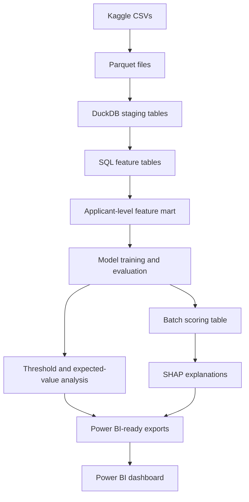
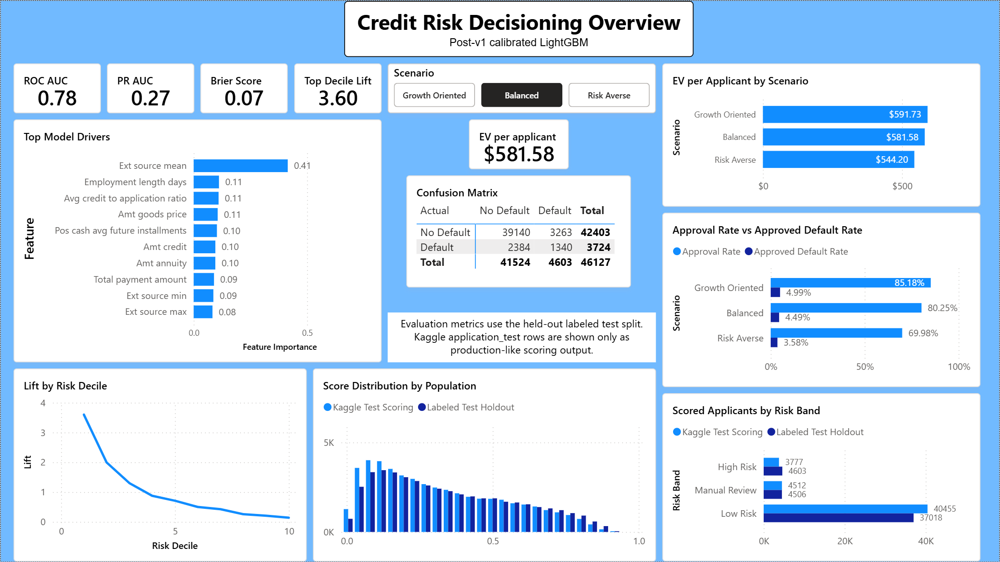
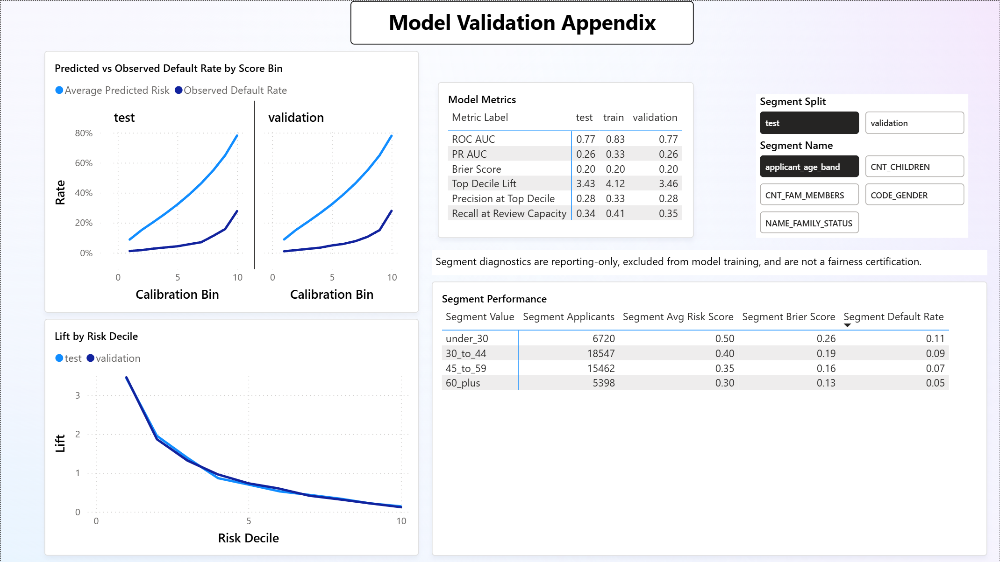

# Loan Default Risk Decisioning System

> End-to-end financial decision-support project for loan default risk: SQL feature engineering, LightGBM modeling, SHAP explainability, batch scoring, threshold analysis, and Power BI reporting.

## Overview

This project simulates a financial-services decision-support workflow. It converts public loan-application data into applicant-level risk-ranking scores, evaluates ranking and uncalibrated score behavior on labeled holdout data, assigns applicants to risk-based action bands, writes batch predictions to DuckDB, and visualizes threshold tradeoffs in Power BI.

The goal is not production underwriting. The goal is to show an applied ML engineering workflow that connects data contracts, feature engineering, model validation, business thresholds, explainability, and dashboard-ready outputs.

## Business Question

Which applicants are most likely to experience repayment difficulty, and how should score thresholds be set to balance approval rate, default capture, manual review workload, and illustrative portfolio value?

## Architecture



## Dataset

Primary dataset: Home Credit Default Risk public Kaggle dataset.

The model predicts:

```text
TARGET = 1: applicant experienced repayment difficulty
TARGET = 0: applicant did not experience observed repayment difficulty
```

v1 uses these source files:

- `application_train.csv`
- `application_test.csv`
- `bureau.csv`
- `previous_application.csv`
- `installments_payments.csv`

Kaggle `application_test` rows are scored for production-like demonstration only. They are not used for validation metrics because they do not include labels.

## Stack

| Layer | Tools |
|---|---|
| Storage | Parquet |
| Database | DuckDB |
| Feature engineering | SQL |
| Modeling | Python, pandas, scikit-learn, LightGBM |
| Evaluation | scikit-learn |
| Explainability | SHAP |
| Testing | pytest, ruff |
| Reproducibility | Makefile, Dockerfile |
| Reporting | Power BI |

## Modeling Approach

The project trains a logistic regression baseline and a tuned LightGBM primary model. The LightGBM search is intentionally bounded: it compares a small set of prior-informed candidates using validation-only selection, with PR-AUC as the main ranking metric and lift, recall-at-review-capacity, ROC-AUC, Brier score, and non-degenerate score distribution as guardrails.

v1 scores are not fitted calibrated default probabilities. The project evaluates probability quality with Brier score and calibration bins, but no Platt/sigmoid or isotonic calibration layer is fitted in v1. Treat score thresholds as validation-derived ranking cutoffs, not as literal default-probability policy thresholds.

Post-v1 Experiment 004 adds a separate sigmoid calibration artifact for the Experiment 003 LightGBM model. This is one of the strongest post-v1 improvements: held-out test Brier score improves from `0.174848` to `0.066550`, and weighted calibration-bin error improves from `0.295293` to `0.002823` without changing rank metrics.

| Post-v1 calibration result | Uncalibrated | Sigmoid calibrated | Difference |
|---|---:|---:|---:|
| Validation Brier score | 0.175712 | 0.066535 | -0.109176 |
| Test Brier score | 0.174848 | 0.066550 | -0.108298 |
| Validation weighted bin error | 0.296805 | 0.002704 | -0.294101 |
| Test weighted bin error | 0.295293 | 0.002823 | -0.292470 |

Batch scoring and dashboard exports keep the original rank score as `score` / `raw_risk_score` and add `calibrated_risk_score` plus `calibration_method`. This preserves the existing threshold-policy audit trail while making calibrated score quality visible downstream.

Accuracy is not used as the headline metric because repayment difficulty is an imbalanced outcome.

## Final Model Results

Selected model: `lightgbm` (`lightgbm_credit_risk_v1`).

| Split | PR-AUC | ROC-AUC | Brier | Top-decile lift | Recall at 10% review capacity |
|---|---:|---:|---:|---:|---:|
| Validation | 0.258667 | 0.769216 | 0.171864 | 3.506754 | 0.350698 |
| Held-out test | 0.257943 | 0.771017 | 0.171325 | 3.471847 | 0.347207 |

Validation comparison against the logistic regression baseline:

| Metric | Logistic regression | LightGBM | Difference |
|---|---:|---:|---:|
| PR-AUC | 0.244617 | 0.258667 | +0.014050 |
| ROC-AUC | 0.757608 | 0.769216 | +0.011608 |
| Brier score | 0.200474 | 0.171864 | -0.028610 |
| Top-decile lift | 3.337592 | 3.506754 | +0.169162 |
| Recall at 10% review capacity | 0.333781 | 0.350698 | +0.016917 |

## Decision Policy

Model scores are converted into simulated business actions:

| Score range | Risk band | Simulated action |
|---:|---|---|
| `< T_low` | Low risk | Approve |
| `T_low` to `< T_high` | Medium risk | Manual review |
| `>= T_high` | High risk | Decline or high-priority review |

Thresholds are selected using validation-set scores and explicit business assumptions. The selected balanced scenario uses:

These thresholds are score cutoffs from the selected uncalibrated model. They are useful for comparing rank-based action policies in this portfolio simulation, but they should not be read as calibrated probability-of-default cutoffs.

| Scenario | `T_low` | `T_high` | Test approval rate | Test review rate | Test high-risk rate | Test EV / applicant |
|---|---:|---:|---:|---:|---:|---:|
| Balanced | 0.581632 | 0.694617 | 0.8008 | 0.0973 | 0.1019 | 575.44 |

## Expected-Value Framework

```text
Expected value =
    approved_good_count * expected_margin_per_good_loan
  - approved_bad_count * expected_loss_per_bad_loan
  - manual_review_count * manual_review_cost
```

Scenario assumptions:

| Assumption | Value |
|---|---:|
| Expected margin per good approved loan | 1000 |
| Expected loss per bad approved loan | 5000 |
| Manual review cost | 50 |
| Manual review capacity | 10% of applicants |

These are illustrative assumptions used to compare threshold behavior. They are not real Home Credit economics.

Interpretation: the `1000` margin and `5000` loss values are utility weights for comparing scenarios, not calibrated loan-level profit and loss estimates. They intentionally encode that approving a bad loan is much more costly than approving a good loan is valuable, while keeping the v1 dashboard readable. A production-style value model would scale margin and loss by exposure, term, pricing, funding cost, recovery, and loss-given-default assumptions.

## Power BI Dashboard

The dashboard summarizes the decisioning workflow with KPI cards, score distribution, threshold scenario comparison, risk-band action mix, expected-value behavior, lift/calibration validation, and top model drivers.





Power BI consumes CSV exports from `reports/dashboard_data/`, which are generated from DuckDB tables by `make dashboard-data`.

## Key Outputs

| Artifact | Purpose |
|---|---|
| `mart_credit_risk_features` | One-row-per-applicant feature mart |
| `models/lightgbm_credit_risk.joblib` | Selected tuned LightGBM artifact |
| `reports/model_metrics_summary.csv` | Model metrics by split |
| `reports/lightgbm_tuning_summary.csv` | LightGBM candidate comparison |
| `reports/model_threshold_metrics.csv` | Threshold scenario metrics |
| `reports/business_value_analysis.md` | Expected-value scenario summary |
| `reports/model_feature_importance.csv` | SHAP global feature importance |
| `reports/model_card.md` | Intended use, limitations, and validation summary |
| `reports/experiments/` | Post-v1 experiment reports and comparison log |
| `reports/dashboard_data/` | Power BI-ready export tables |
| `powerbi/screenshots/` | Dashboard screenshots |

## Top Model Drivers

The top SHAP-ranked drivers include external source aggregates, prior application amount ratios, requested credit/goods amounts, employment length, payment delay behavior, and repayment-history features. SHAP outputs are used for model interpretation and debugging only; they are not legally compliant adverse-action notices.

## How to Run

```bash
make setup
make ingest
make features
make train
make evaluate
make score
make dashboard-data
make test
```

Raw Kaggle data is not committed. Download the dataset separately and place the CSV files in `data/raw/`.

## Repository Structure

```text
loan-default-risk-decisioning-system/
|-- README.md
|-- PROJECT_SPEC.md
|-- IMPLEMENTATION_PLAN.md
|-- TESTING_PLAN.md
|-- VALIDATION_PLAN.md
|-- Makefile
|-- Dockerfile
|-- requirements.txt
|-- configs/
|-- data/
|-- docs/
|-- models/
|-- notebooks/
|-- powerbi/
|-- reports/
|-- sql/
|-- src/
`-- tests/
```

## Limitations

This is a portfolio decision-support simulation, not an automated underwriting system.

The target is a proxy for observed repayment difficulty, not a complete loss/default framework. Expected value is illustrative and depends on simplified assumptions. The model is validated on a static public dataset and does not include production monitoring, adverse-action controls, fair-lending review, compliance approval, or model governance.

Direct demographic and protected-status-like fields are excluded from v1 model features. If age, gender, marital status, or family-status-like fields are inspected, they are retained only in a separate diagnostic layer for limitation checks, not model training or deployment approval.

Post-v1 work can add richer monthly history tables such as `bureau_balance`, `POS_CASH_balance`, and `credit_card_balance`, plus deeper monitoring and validation. Those are intentionally outside the v1 scope.
