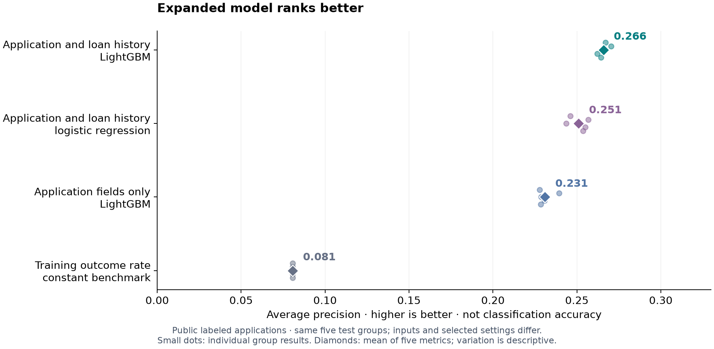
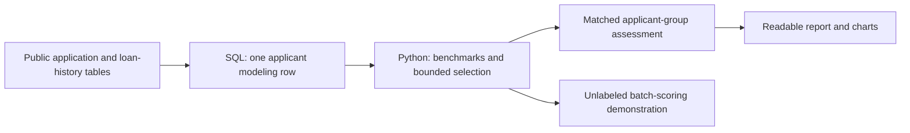

# Credit risk from application and repayment history

**Can prior loan and repayment history improve risk ranking beyond an application form?**

This public Home Credit portfolio joins relational credit data with SQL, builds and compares risk models in Python, and turns the results into readable decision-support reporting. It demonstrates data engineering, careful assessment and clear communication for recruiters and hiring managers.

The current five-group assessment covers **261,384 labeled applicants**. Application and loan history achieved **0.266 average precision**, compared with **0.231** using application fields only and **0.251** for logistic regression. Average precision measures ranking of repayment-difficulty cases; it is not accuracy. These are means of five matched applicant test-group metrics. Prior public-data exploration prevents an untouched final-test claim, and random groups do not establish future-cohort performance.

## Start here

1. Read the [case study](reports/portfolio/case_study.md) for the problem, engineering decisions, results and limits.
2. Open the [browser report](https://stevennitesh.github.io/loan-default-risk-decisioning-system/), or download/open the [standalone offline report](reports/portfolio/index.html). The standalone file includes every current chart and needs no network connection.
3. For technical detail, follow the [current assessment](reports/tuning_20261004/assessment_report.md), [assessment methodology](docs/validation/ASSESSMENT_METHODOLOGY.md) and [model card](reports/model_card.md).



Small dots show the five individual group metrics; diamonds show their mean. Variation is descriptive, not a confidence interval. Every model predicts the same applicants in each group. The constant training-outcome-rate benchmark shows the importance of comparing against a simple baseline.

## What I built

| Layer | Responsibility |
|---|---|
| SQL / DuckDB | Join application, bureau, previous-loan and repayment tables into one applicant modeling row per source population. Count obligations once across split payments; keep unknown and ambiguous history explicit. |
| Python | Orchestrate ingestion, fitting, model selection, assessment, batch scoring, SHAP interpretation and report exports. |
| Assessment | Compare a constant benchmark, logistic regression and application-only/history LightGBM on five matched applicant test groups. Keep fitting, stopping, probability-adjustment and selection roles separate. |
| Reporting | Generate an offline story and exportable charts from anonymous committed aggregates; retain explicit Power BI table contracts. |
| Verification | Test relational grain, source semantics, excluded fields, model/score identities, metric ties, simulated actions, utility and report contracts with synthetic fixtures. |


```mermaid
flowchart LR
    sources[Public application and loan-history tables] --> sql[SQL: one applicant modeling row]
    sql --> models[Python: benchmarks and bounded selection]
    models --> evidence[Matched applicant-group assessment]
    evidence --> story[Readable report and charts]
    models --> demo[Unlabeled batch-scoring demonstration]
```

The outcome records **repayment difficulty**, a proxy rather than measured financial loss. Applicant identifiers, the outcome and direct demographic/protected-status-like fields are excluded from model inputs. Diagnostic fields stay separate. Unlabeled Kaggle applications demonstrate scoring and contribute no outcome metrics.

## What the results mean

- **History adds ranking information.** The matched application-only comparison isolates the engineering value of adding prior loan and repayment inputs within this assessment; it does not establish a causal effect.
- **Probability quality is a separate check.** The history model's Brier score is **0.067**, log loss **0.241** and ROC AUC **0.776**. Lower Brier/log loss is better. All five history models selected 174 inputs and unchanged raw probabilities after separate probability-adjustment testing.
- **More search reached a ranking plateau.** Earlier corrected average precision was 0.265750; current average precision is 0.265862. Raw probabilities improved substantially, while final probability quality stayed similar.
- **Class weighting explains much of the probability change.** Weighting gives rare repayment-difficulty cases extra influence during fitting. In [a controlled follow-up](reports/class_weighting_20261004/assessment_report.md), removing that weight from the earlier recipe reduced raw Brier score from 0.1573 to 0.0666, essentially reproducing the current 0.0667. This isolates a model-setting effect within the frozen recipes; it does not establish weights for other populations or the search screen's separate contribution.
- **Actions are simulations.** Lower/upper score cutoffs define simulated approval, manual review and simulated decline. Only the middle band incurs review cost. Utility uses illustrative units, not dollars or profit, and does not promise a fixed review queue.

The [case study](reports/portfolio/case_study.md) shows highest-risk-group capture, predicted-versus-observed probabilities, matched installment-history segments, all 27 utility assumptions and current model inputs. Imported external credit scores lead individual input magnitudes; cumulative group magnitudes also depend on group size and correlated inputs. These are fitted-model explanations, not causal effects or shares of predictive performance. PNG and SVG versions are available in [the presentation folder](reports/portfolio/); [exact aggregate metrics](reports/portfolio/metrics.csv) and [presentation provenance](reports/portfolio/provenance.json) retain precision and source identities.

## Read the code

The [project specification](docs/spec/PROJECT_SPEC.md) owns scope, domain meaning and population contracts. Start with [SQL feature assembly](sql/06_build_feature_mart.sql), [training](src/train.py), [matched assessment](src/nested_assessment.py), [presentation renderer](src/portfolio_report.py) and [export schemas](src/report_contracts.py). [Tests](docs/testing/TESTING_PLAN.md) describe fixture coverage; [command ownership](docs/implementation/IMPLEMENTATION_PLAN.md#5-command-to-artifact-map) maps commands to artifacts.

## Recreate the presentation without data

Install the project dependencies first using [How To Run](#how-to-run), then generate the presentation:

```bash
make portfolio
```

On Windows where `python3` is unavailable:

```powershell
make portfolio PYTHON=python
```

The renderer reads only the committed anonymous results in `reports/tuning_20261004/` and the controlled weighting evidence in `reports/class_weighting_20261004/` and anonymous frozen-model input magnitudes in `reports/model_inputs_20261004/`. It writes `reports/portfolio/`, checks matched population counts, fold-summary agreement and weighting-run identity, and records input/renderer/output hashes. It does not download data, load model artifacts, fit models or replace frozen scientific evidence. The HTML embeds images and styles; PNG/SVG files support GitHub viewing and reuse. Exact technical keys remain in the numeric appendix and metric dictionary. `make portfolio-site` verifies the reviewed final-file allowlist and hashes, then copies only the static presentation into `.tmp/portfolio-site/`; the Pages workflow publishes this folder. Repository-wide data/models/scratch files are never uploaded. Source evidence links point to GitHub; adjacent downloads work online and offline when the presentation folder is retained. The HTML alone keeps all eight charts and text offline.

`make portfolio-inputs` is a separate local diagnostic requiring the completed current five frozen models and identified mart. It reads the database in read-only mode and reuses saved preprocessing/native TreeSHAP on 1,000 target-blind assessment rows per fold (seed 20261004), with no fitting or selection. Only anonymous per-fold/mean magnitudes, the input dictionary and provenance are curated; the ordinary presentation renderer does not need those models or data.

## How To Run

Raw Kaggle data is not committed. Download the dataset separately and place the CSV files in `data/raw/`.

To check the code without downloading data (Python 3.12 and Make):

```bash
make setup
make lint
make format-check
make test
```

`make setup` installs dependencies into the selected interpreter; it does not create a virtual environment. On Windows where `python3` is unavailable, append `PYTHON=python` to Make commands, for example `make test PYTHON=python`. The Docker image defaults to `make test` and is a test container.

To regenerate scoped local artifacts with the downloaded data:

```bash
make pipeline-v1
make pipeline-post-v1
```

These commands overwrite generated local outputs. They do not refresh committed snapshots, screenshots, or PBIX visuals. `requirements.lock` pins the dependency closure used for the named correctness run; current artifacts still differ from historical experiment metrics. See the locked run instructions below.

For step-by-step post-v1 work, pass the same config at every step:

```bash
make ingest CONFIG=configs/post_v1.yaml
make features CONFIG=configs/post_v1.yaml
make train CONFIG=configs/post_v1.yaml
make evaluate CONFIG=configs/post_v1.yaml
make calibrate CONFIG=configs/post_v1.yaml
make score CONFIG=configs/post_v1.yaml
make explain CONFIG=configs/post_v1.yaml
```

Bare step targets use `configs/base.yaml`, a post-v1 feature scope with separate default output paths. For v1, use `CONFIG=configs/v1.yaml` and omit calibration. Power BI consumes `reports/dashboard_data/` for v1 and `reports/dashboard_data_post_v1/` for post-v1. `make dashboard-data` and `make dashboard-data-post-v1` export from existing scoped artifacts without retraining; export also recomputes segment diagnostics and, for post-v1, calibrated probability-quality metrics.

After the 2026-10-04 methodology corrections, regenerate dependent artifacts in order with `make pipeline-post-v1 PYTHON=python` (omit the interpreter override where `python3` works). Calibrating an old model alone is insufficient: corrected models require an identified feature build and reserved calibration IDs. Feature builds, fitted models, evaluation thresholds, scored rows, and calibrators now carry local identity checks; replacing a parent or calibrator requires rebuilding its dependent outputs. `make pipeline-v1` likewise uses corrected repayment features and row bagging, so it is a regeneration of the v1 source scope, not an exact reproduction of historical numbers. Both commands overwrite ignored runtime outputs; curated experiment numbers, PBIX files, and screenshots remain historical.

## Assessing the Selection Procedure

After generating compatible post-v1 features/models, run:

```bash
make assess-post-v1 PYTHON=python
```

This separate command assesses history-selected LightGBM and three declared
comparators on five matched outer folds with the current training-only inner-CV selection. Within each
fold, fitting, calibration and selection remain disjoint; each frozen workflow
predicts the same outer applicants. History feature rankings average three model-seed repeats within fitting
data. Split seeds and model seeds are configured independently. Each run creates
an ignored folder under `reports/post_v1/nested_assessment/` with exact local role
IDs, settings/seeds, selected fold artifacts, predictions, and a readable report.
It does not change the saved dashboard model or historical snapshots.

[The methodology explanation](docs/validation/ASSESSMENT_METHODOLOGY.md) covers
population sizes, why selection metrics can be optimistic, what nested assessment
estimates, and why random folds cannot establish future-cohort performance.
The completed results for this selection procedure are in [the current application-and-loan-history assessment](reports/tuning_20261004/assessment_report.md), including matched controls and a sampled shuffled-outcome diagnostic. [The earlier corrected assessment](reports/correctness_20261004/assessment_report.md) preserves the prior reserved-holdout selection procedure and source-data validation. The default current comparison includes top-40, top-80, and full input groups
with one 24-candidate joint tuning budget, so this command performs more fits than
ordinary training. It is intentionally separate from the main pipeline.

## Locked correctness evidence

The [earlier repaired assessment report](reports/correctness_20261004/assessment_report.md) separates full-data outer evidence, saved-model reused comparison, and historical Power BI snapshots. Its [corrected aggregate HTML](reports/correctness_20261004/corrected_evidence.html) is generated from the verified CSV bundle; it is not a refreshed PBIX.

```powershell
uv venv .tmp/assessment-env --python 3.12 --cache-dir .tmp/uv-cache
uv pip sync requirements.lock --require-hashes --python .tmp/assessment-env/Scripts/python.exe --cache-dir .tmp/uv-cache
make lint format-check test PYTHON=.tmp/assessment-env/Scripts/python.exe
```

The completed local scopes are `configs/correctness_20261004_post_v1_r2.yaml` and `configs/correctness_20261004_v1_r2.yaml`. Their isolated outputs preserve the original defaults and historical artifacts. Before the first training run in any fresh scope, copy the original scoped LightGBM artifact into its new model directory to retain original comparison IDs; retain a local `historical_split_reference.json`. A fresh artifact directory without that reference would create a different population. Keep exact role IDs local and do not publish applicant-level evidence.

`python -m src.correctness_run --config <fresh-scoped-config>` executes the ordered raw-to-dashboard pipeline and writes a phase manifest/logs. It requires a fresh output directory and retains failures. `src.source_reconciliation` performs independent Python checks of actual source examples. `src.nested_assessment` executes the declared matched protocol; `configs/correctness_20261004_negative_control_r2.yaml` selects a stratified 20,000-row seed-913 shuffled-label diagnostic using the same full recipe. `src.assessment_diagnostics`, `src.assessment_reproduce` and `src.correctness_summary` generate frozen diagnostics, clean-environment reproduction and anonymous presentation evidence. Exact completed commands and paths are in the evidence report/manifest. No model promotion uses outer results.


## Evidence limits and history

This is a local portfolio decision-support simulation. It does not establish underwriting, compliance, fair-lending or adverse-action readiness. Calendar application, field-availability and label-maturity timestamps are unavailable; relative offsets cannot certify real-time availability. Historical public-data exploration remains a limitation even with disjoint fitting/selection roles. Same-host reproduction is not cross-hardware certification. See [current evidence status](docs/validation/VALIDATION_PLAN.md#current-evidence-status).

The current reader journey starts with [the application-and-loan-history case study](reports/portfolio/case_study.md) and [current assessment](reports/tuning_20261004/assessment_report.md). The saved [Power BI files and screenshots](powerbi/README.md) are **unrefreshed historical demonstrations**. Native Desktop/DAX refresh was unavailable on this host. These assets are preserved; the new HTML and plots are separate outputs.

For the documented development trail, use the [historical experiment archive](reports/experiments/README.md). Original numbers and dated conclusions are retained there, including the earlier 68-input and 168-input comparisons. They are historical comparisons, not current selection instructions or independent final-test evidence. The [prior corrected assessment](reports/correctness_20261004/assessment_report.md) preserves the earlier repaired protocol; the [current tuning assessment](reports/tuning_20261004/assessment_report.md) identifies the current completed procedure.

Downloaded data, applicant-level records, exact memberships, fitted models and intermediate outputs stay local. Only deliberately curated final reports, charts and anonymous aggregate evidence are included in Git; [reports policy](reports/README.md) owns that boundary.

## Repository Guide

| Folder | Contents |
|---|---|
| `sql/`, `src/`, `tests/` | Model-input SQL, Python pipeline/reporting and synthetic verification fixtures. |
| `configs/`, `docs/` | Declared settings, scope, assessment/testing and command ownership. |
| `reports/portfolio/` | Current case study, standalone report, charts and anonymous numeric appendix. |
| `reports/tuning_20261004/`, `reports/correctness_20261004/` | Identified current/prior technical evidence. |
| `reports/experiments/`, `powerbi/` | Historical development trail and saved Power BI demonstrations. |
| `data/`, `models/`, `.tmp/` | Local source/intermediate data, model artifacts and scratch work; ignored by Git. |
