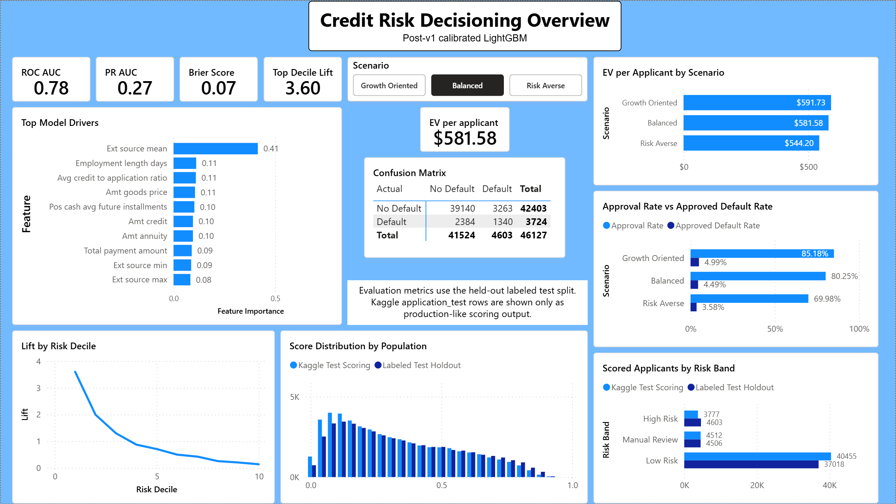
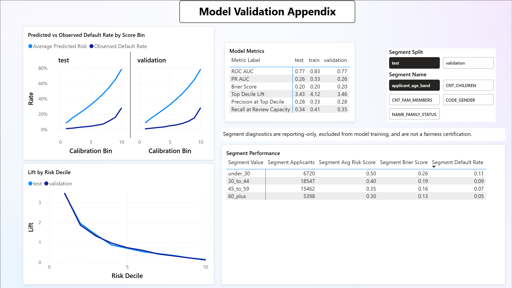
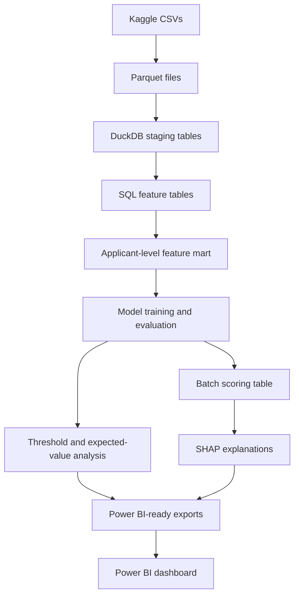

# Loan Default Risk Decisioning System

End-to-end credit-risk decision-support project using public Home Credit data, SQL feature engineering, LightGBM modeling, validation-driven threshold analysis, SHAP explainability, batch scoring, and Power BI reporting.

This is a portfolio project, not a production underwriting system. The goal is to show how I would turn messy relational credit data into a reproducible analytics and ML workflow that supports risk ranking, business tradeoff analysis, and dashboard-ready reporting.

## Outcome At A Glance

Built a complete credit-risk decision-support workflow: raw public Kaggle CSVs become a DuckDB feature mart, trained LightGBM models, validation-driven threshold scenarios, scored applicant tables, SHAP interpretation outputs, and Power BI dashboard exports.

Historical experiment snapshots compare a 68-feature v1 model with a 168-feature post-v1 LightGBM model with sigmoid calibration. They record test PR-AUC increasing from `0.258236` to `0.269925` and Brier score decreasing from `0.171245` to `0.066460`. These are exploratory comparison results: repeated-seed runs reused original test applicants in fitting, SHAP-ranked selection used reporting populations, and calibration fitting and selection shared validation data. They do not establish an independent final-test improvement.

The strongest portfolio contribution is the complete SQL-to-dashboard workflow and a documented experiment trail, including unsuccessful simplification attempts and identified correctness gaps. [Current evidence status](docs/validation/VALIDATION_PLAN.md#current-evidence-status) explains those gaps; the [remediation plan](docs/implementation/PORTFOLIO_INTEGRITY_REMEDIATION_PLAN.md) proposes repairs that have not been implemented.

## Two-Minute Review Path

1. Review the dashboard screenshots below for the business-facing output.
2. Scan the Key Results section for model and decisioning outcomes.
3. Read [V1 to Post-v1 Comparison](reports/experiments/v1_to_post_v1_model_diff.md) for the experiment story, then [current evidence status](docs/validation/VALIDATION_PLAN.md#current-evidence-status) for what remains unverified.

## Project Snapshot

| Area | Summary |
|---|---|
| Business problem | Rank loan applicants by repayment-difficulty risk and translate scores into simulated approve / review / high-risk actions. |
| Dataset | Home Credit Default Risk public Kaggle dataset. |
| Core build | CSV to Parquet to DuckDB staging to SQL feature mart to model training, evaluation, scoring, and dashboard exports. |
| Modeling | Logistic regression baseline and LightGBM primary model. |
| Evaluation focus | Average precision (legacy PR-AUC), ROC-AUC, Brier score, lift, top-ranked default capture, calibration, and scenario utility. |
| Reporting | Power BI dashboard backed by explicit exported table contracts. |
| Status | Runnable local pipeline; curated historical v1/post-v1 comparison; methodology repairs pending. |

## Dashboard Preview

The Power BI report turns model outputs into an executive decisioning view: portfolio mix, risk-band actions, threshold tradeoffs, model validation, calibration, lift, and top drivers.

Both screenshots below show the historical **post-v1** report. Their currency-formatted expected-value labels represent utility weights, and their "held-out" and review-capacity labels require the qualifications above. Saved screenshots are portfolio snapshots; a local rerun can produce different values. See the [Power BI guide](powerbi/README.md) before refreshing or interpreting them.



The overview page shows portfolio mix, risk-band recommendations, threshold scenario tradeoffs, and top model drivers for a non-technical decisioning audience.



The validation appendix surfaces model-quality checks such as PR-AUC, ROC-AUC, lift, calibration, and segment diagnostics so the dashboard does not hide model-risk context.

## What This Demonstrates

- SQL-first feature engineering over relational application, bureau, prior-application, and repayment-history tables.
- Configured local pipeline with Makefile commands, DuckDB, and generated artifacts; exact historical numeric reproduction is not certified.
- Imbalanced-class model evaluation without relying on accuracy as the headline metric.
- Validation-quantile threshold scenarios for simulated approve / review / high-priority-review bands.
- Expected-value analysis that connects model scores to business tradeoffs.
- SHAP-based model interpretation with clear limits on adverse-action and compliance claims.
- Power BI-ready export contracts instead of ad hoc notebook outputs.
- Tests for data contracts, feature grain, scoring schema, threshold policy, expected value, calibration, and dashboard artifacts.

## Key Results

The values below preserve curated historical snapshots from [the experiment log](reports/experiments/experiment_log.csv), rows `000` and `015`. They are not live metrics from your current local artifacts. "Held-out test" retains the original split label and means historical comparison here. PR-AUC is scikit-learn average precision; "top-10% default capture" is the legacy `recall_at_manual_review_capacity` ranking metric, not recall within the middle manual-review band. EV columns are retrospective scenario utility per applicant.

Historical v1 selected model: `lightgbm_credit_risk_v1`.

| Outcome | Result |
|---|---:|
| Held-out test PR-AUC | 0.258236 |
| Held-out test ROC-AUC | 0.770385 |
| Held-out test Brier score | 0.171245 |
| Held-out test top-decile lift | 3.482588 |
| Historical test top-10% default capture | 0.348281 |
| Validation PR-AUC improvement over logistic regression | +0.015556 |

The historical post-v1 selection retained 168 features and sigmoid calibration. Its recorded test Brier score falls from an uncalibrated `0.173301` to `0.066460`, with unchanged ranking under the sigmoid transform. Independent calibration assessment and corrected feature semantics are still needed before claiming a verified probability model.

| Post-v1 improvement | Frozen v1 | Best post-v1 | Difference |
|---|---:|---:|---:|
| Feature count | 68 | 168 | +100 |
| Validation PR-AUC | 0.260173 | 0.272184 | +0.012011 |
| Validation ROC-AUC | 0.770420 | 0.778732 | +0.008312 |
| Validation Brier score | 0.171640 | 0.066500 | -0.105139 |
| Validation top-decile lift | 3.490643 | 3.659805 | +0.169162 |
| Validation top-10% default capture | 0.349087 | 0.366004 | +0.016917 |
| Validation balanced utility / applicant | 571.52 | 577.24 | +5.72 |
| Held-out test PR-AUC | 0.258236 | 0.269925 | +0.011689 |
| Held-out test ROC-AUC | 0.770385 | 0.780208 | +0.009823 |
| Held-out test Brier score | 0.171245 | 0.066460 | -0.104786 |
| Held-out test top-decile lift | 3.482588 | 3.600733 | +0.118145 |
| Historical test top-10% default capture | 0.348281 | 0.360097 | +0.011815 |
| Historical test balanced utility / applicant | 572.03 | 581.58 | +9.55 |

Within the historical comparisons, calibration gave the largest recorded probability-quality change and recent-record features were promising. Cleanup did not win the mean-validation ranking rule. Correcting the assessment and feature semantics is necessary before treating those findings as verified improvements.

For the concise validation trail, see [V1 to Best Post-v1 Model Diff](reports/experiments/v1_to_post_v1_model_diff.md).

## Architecture


```mermaid
flowchart TB
    raw["Kaggle CSVs"] --> parquet["Parquet files"]
    parquet --> staging["DuckDB staging tables"]
    staging --> features["SQL feature tables"]
    features --> mart["Applicant-level feature mart"]
    mart --> train["Model training and evaluation"]
    train --> thresholds["Threshold and expected-value analysis"]
    train --> scoring["Batch scoring table"]
    scoring --> explain["SHAP explanations"]
    thresholds --> exports["Power BI-ready exports"]
    explain --> exports
    exports --> dashboard["Power BI dashboard"]
```

## Business Question

Which applicants are most likely to experience repayment difficulty, and how should score thresholds be set to balance approval rate, default capture, manual review workload, and illustrative portfolio value?

Model scores are converted into simulated business actions:

| Score range | Risk band | Simulated action |
|---:|---|---|
| `< T_low` | Low risk | Approve |
| `T_low` to `< T_high` | Medium risk | Manual review |
| `>= T_high` | High risk | High-priority review |

The selected v1 balanced scenario uses validation-derived score cutoffs. These are ranking-policy cutoffs, not calibrated probability-of-default cutoffs.

"Balanced" is a predefined display scenario, not a proven optimum. The 10% setting is a reference for quantile scenarios and ranking metrics, not an enforced queue limit. The current utility formula charges only the middle manual-review band; it does not cost the high-priority-review band or model its disposition. This action/value mismatch is an open correctness issue.

| Scenario | `T_low` | `T_high` | Test approval rate | Test review rate | Test high-risk rate | Test EV / applicant |
|---|---:|---:|---:|---:|---:|---:|
| Balanced | 0.580982 | 0.695323 | 0.8010 | 0.0967 | 0.1023 | 572.03 |

Expected value is illustrative:

```text
Expected value =
    approved_good_count * expected_margin_per_good_loan
  - approved_bad_count * expected_loss_per_bad_loan
  - manual_review_count * manual_review_cost
```

| Assumption | Value |
|---|---:|
| Expected margin per good approved loan | 1000 |
| Expected loss per bad approved loan | 5000 |
| Manual review cost | 50 |
| Review-rate scenario reference (not a hard cap) | 10% of applicants |

## Dataset

Primary dataset: Home Credit Default Risk public Kaggle dataset.

The model predicts:

```text
TARGET = 1: applicant experienced repayment difficulty
TARGET = 0: applicant did not experience observed repayment difficulty
```

v1 uses:

- `application_train.csv`
- `application_test.csv`
- `bureau.csv`
- `previous_application.csv`
- `installments_payments.csv`

Post-v1 adds richer monthly history sources:

- `bureau_balance.csv`
- `POS_CASH_balance.csv`
- `credit_card_balance.csv`

Kaggle `application_test` rows are scored for a production-like batch scoring demonstration only. They are not used for validation metrics because they do not include labels.

## Technology Stack

| Layer | Tools |
|---|---|
| Storage | Parquet |
| Database | DuckDB |
| Feature engineering | SQL |
| Modeling | Python, pandas, scikit-learn, LightGBM |
| Evaluation | scikit-learn |
| Explainability | SHAP |
| Testing | pytest, ruff |
| Reproducibility | Makefile, Dockerfile |
| Reporting | Power BI |

## How To Review This Repo

For a quick review:

1. Start with the dashboard screenshots above.
2. Read the business and result summaries in this README.
3. Inspect the feature and modeling pipeline:
   - [sql/06_build_feature_mart.sql](sql/06_build_feature_mart.sql)
   - [src/train.py](src/train.py)
   - [src/evaluate.py](src/evaluate.py)
   - [src/score_batch.py](src/score_batch.py)
   - [src/dashboard_exports.py](src/dashboard_exports.py)
4. Review tests under `tests/`, especially data contracts, scoring schema, threshold policy, expected value, and dashboard artifacts.
5. Read [reports/model_card.md](reports/model_card.md) for intended use, limitations, and validation framing.
6. Read [reports/experiments/v1_to_post_v1_model_diff.md](reports/experiments/v1_to_post_v1_model_diff.md) for the concise post-v1 improvement trail.

## How To Run

Raw Kaggle data is not committed. Download the dataset separately and place the CSV files in `data/raw/`.

To check the code without downloading data (Python 3.12 and Make):

```bash
make setup
make lint
make format-check
make test
```

`make setup` installs dependencies into the selected interpreter; it does not create a virtual environment. On Windows where `python3` is unavailable, append `PYTHON=python` to Make commands, for example `make test PYTHON=python`. The Docker image defaults to `make test` and is a test container.

To regenerate scoped local artifacts with the downloaded data:

```bash
make pipeline-v1
make pipeline-post-v1
```

These commands overwrite generated local outputs. They do not refresh committed snapshots, screenshots, or PBIX visuals. Dependencies are not locked, and current local artifacts can differ from the historical metrics above.

For step-by-step post-v1 work, pass the same config at every step:

```bash
make ingest CONFIG=configs/post_v1.yaml
make features CONFIG=configs/post_v1.yaml
make train CONFIG=configs/post_v1.yaml
make evaluate CONFIG=configs/post_v1.yaml
make calibrate CONFIG=configs/post_v1.yaml
make score CONFIG=configs/post_v1.yaml
make explain CONFIG=configs/post_v1.yaml
```

Bare step targets use `configs/base.yaml`, a post-v1 feature scope with separate default output paths. For v1, use `CONFIG=configs/v1.yaml` and omit calibration. Power BI consumes `reports/dashboard_data/` for v1 and `reports/dashboard_data_post_v1/` for post-v1. `make dashboard-data` and `make dashboard-data-post-v1` export from existing scoped artifacts without retraining; export also recomputes segment diagnostics and, for post-v1, calibrated probability-quality metrics.

## Repository Guide

```text
loan-default-risk-decisioning-system/
|-- README.md
|-- Makefile
|-- Dockerfile
|-- requirements.txt
|-- configs/              # v1 and post-v1 reproducibility configs
|-- data/                 # local raw/parquet/db directories; data files ignored
|-- docs/                 # project spec, implementation, testing, and validation plans
|-- models/               # generated model artifacts ignored; directory retained with .gitkeep
|-- powerbi/              # Power BI files and screenshots
|-- reports/              # model card, experiment reports, curated comparison artifacts
|-- sql/                  # staging and feature-mart SQL
|-- src/                  # orchestration, training, evaluation, scoring, exports
`-- tests/                # pytest suite for pipeline contracts and business logic
```

## Key Artifacts

| Artifact | Purpose |
|---|---|
| [docs/spec/PROJECT_SPEC.md](docs/spec/PROJECT_SPEC.md) | Scope, contracts, non-goals, model-risk posture, and acceptance criteria. |
| [docs/implementation/IMPLEMENTATION_PLAN.md](docs/implementation/IMPLEMENTATION_PLAN.md) | Build order and command-to-artifact expectations. |
| [docs/testing/TESTING_PLAN.md](docs/testing/TESTING_PLAN.md) | Test scope, fixture strategy, and verification expectations. |
| [docs/validation/VALIDATION_PLAN.md](docs/validation/VALIDATION_PLAN.md) | Model and reporting gates. |
| [reports/model_card.md](reports/model_card.md) | Intended use, limitations, validation summary, and model-risk framing. |
| [reports/README.md](reports/README.md) | Explains committed experiment evidence versus regenerated local outputs. |
| [reports/experiments/](reports/experiments/) | Post-v1 experiment reports and comparison log. |
| [reports/experiments/v1_to_post_v1_model_diff.md](reports/experiments/v1_to_post_v1_model_diff.md) | Concise v1 to best post-v1 improvement summary. |
| [configs/v1.yaml](configs/v1.yaml) | v1 feature scope and local regeneration paths. |
| [configs/post_v1.yaml](configs/post_v1.yaml) | Historical post-v1 feature scope and local regeneration paths. |
| [powerbi/dashboard.pbix](powerbi/dashboard.pbix) | v1 Power BI dashboard file. |
| [powerbi/dashboard_post_v1.pbix](powerbi/dashboard_post_v1.pbix) | Post-v1 comparison Power BI dashboard file. |

## Limitations

This is a portfolio decision-support simulation, not an automated underwriting system.

The target is a proxy for observed repayment difficulty, not a complete loss/default framework. Expected value uses illustrative utility weights. Evaluation uses a static public dataset with the unresolved selection and assessment boundaries described above. Installment aggregation currently counts payment rows rather than normalized obligations, last-k POS/card features count account records rather than distinct applicant months, and historical-availability and missing-value semantics need review. See [current evidence status](docs/validation/VALIDATION_PLAN.md#current-evidence-status) for the source-backed limits.

Direct demographic and protected-status-like fields are excluded from v1 model features. If age, gender, marital status, or family-status-like fields are inspected, they are retained only in a separate diagnostic layer for limitation checks, not model training or deployment approval.

Post-v1 experiments added `bureau_balance`, `POS_CASH_balance`, and `credit_card_balance`, plus recency and last-k feature candidates. The next proposed work is correctness repair and evidence reconciliation within this local portfolio. Monitoring infrastructure, regulatory review, and deployment interfaces are outside its scope.
