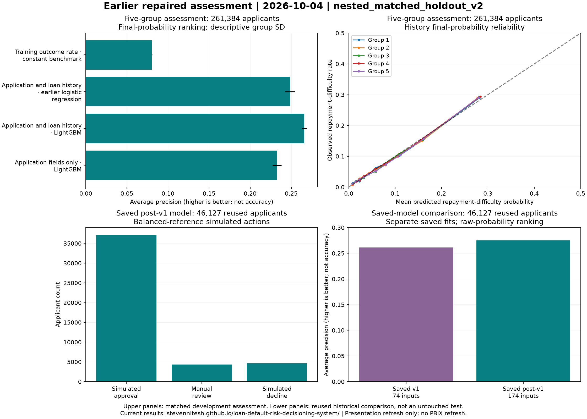

# Earlier repaired assessment, 2026-10-04

**Earlier completed procedure.** This `nested_matched_holdout_v2` assessment precedes the [current `nested_inner_cv_v3` assessment](../tuning_20261004/assessment_report.md), also completed on 2026-10-04. Read [the current case study](../portfolio/case_study.md) first. This report preserves the earlier repaired protocol, source-data checks and saved-model comparison; historical experiments and Power BI assets retain their original values.

| Model / input scope | Brier score | Log loss | Average precision | ROC AUC |
|---|---:|---:|---:|---:|
| Application fields only · LightGBM | 0.068399 | 0.248743 | 0.232638 | 0.749246 |
| Application and loan history · LightGBM | 0.066696 | 0.240738 | 0.265750 | 0.776040 |
| Application and loan history · earlier logistic regression | 0.067500 | 0.244309 | 0.248427 | 0.766581 |
| Training outcome rate · constant benchmark | 0.074211 | 0.280544 | 0.080728 | 0.500000 |

These are means of five applicant test-group metrics. Average precision measures ranking, not accuracy. The table uses final probabilities after choosing whether to adjust raw scores; this earlier procedure selected sigmoid adjustment, unlike the current history fits. `fold_summary.csv` includes raw/calibrated views and descriptive sample SD; SD is not a confidence interval. No pooled cross-fold average precision is reported. `paired_differences.csv` compares history with each declared comparator on exactly matched folds. Application-only ablation measures conditional engineering value, not causal attribution. Model families have different declared optimization budgets and are never chosen using outer metrics.

Application-and-loan-history final-probability average precision was 0.265750. Its matched-fold difference versus application-only averaged 0.033112 (fold range 0.025122 to 0.040060); versus fixed logistic it averaged 0.017323 (range 0.012172 to 0.028076). These observations support predictive engineering value within this population and recipe, with no causal or untouched external-performance claim.

Raw class-weighted history scores had worse probability losses than training prevalence: Brier 0.157305 versus 0.074211, and log loss 0.477672 versus 0.280544. Calibration reduced history Brier to 0.066696 and log loss to 0.240738, below prevalence. Sigmoid was chosen in every fold for all three non-flat workflows. Its monotone mapping preserved ranking metrics, so calibration produced no average-precision/lift improvement. History selected 80 features in three folds and all 174 in two; selected settings varied across folds. This variation is documented, not used to change the predeclared holdout recipe.

## Renewed saved-model comparison

Both corrected v1 (74 features) and post-v1 (174 features) were rebuilt and fitted in isolated paths preserving the original 215,257 training and 46,127 comparison IDs. V1 uses its original 46,127 validation applicants; post-v1 partitions the same reserved population into 23,063 calibration and 23,064 selection applicants. `renewed_saved_model_comparison.csv` records fresh raw-score metrics and model/build identities, distinct from numbered historical snapshots and from the nested estimates. Historical comparison raw average precision was 0.261198 for v1 and 0.275106 for post-v1; ROC AUC was 0.771403 and 0.780821. These differently engineered/selected saved-model recipes remain exploratory comparisons on reused IDs. The post-v1 calibrated dashboard comparison has average precision 0.275106; calibration was fitted/selected on reserved roles rather than this comparison set.

The full population contains 307,511 labeled applicants. The original 46,127 comparison IDs remain excluded from all nested fitting/assessment; 261,384 development applicants receive one outer prediction per workflow. Five outer folds reserve inner roles 70% fitting, 15% calibration and 15% selection. History compares top-40/top-80/full surfaces with eight LightGBM candidates each and ranking seeds 101/211/307; application-only uses all SQL `f_applicant_static` model fields and eight candidates; logistic uses fixed C=1, lbfgs, balanced class weights, max_iter=1000 with training-only imputation/scaling/encoding. Training-prevalence fits only the base fitting labels, has no search/calibration/policy threshold. Model seed and outer seed are 42. No post-selection refit uses reserved rows.

## Source checks and sensitivity

The Python repayment oracle agreed on 4,515 values across 645 actual obligations, using 684 raw/staged payment rows. It retains repeated identical payment records because no unique cashflow key proves duplication. Independent Python monthly calculations agreed on 42 values for 12 actual applicant histories, including multiple accounts/month and matched operand ratios. Full SQL contracts passed with 12,951,918 schedule groups, 180,085 ambiguous groups and 2,831 otherwise unambiguous unknown-payment groups. `source_summary.json` distinguishes actual examples from absent source cases; future censoring is also covered by synthetic regressions.

Strict finite bureau origin `<0` eligibility excludes 25 day-zero origins; no positive or unknown origins were present. Day-zero records are not proven future leakage. Bureau balance and recency use the same eligible-origin owner; planned future maturities remain available on eligible loans. The superseded partial run was stopped before this source correction; no outer metric informed it. Source-relative cutoffs cannot establish intraday/vendor-ingestion availability, and no reliable calendar application dates exist. Random folds cannot establish future-cohort performance.

`source_coverage_by_target.csv` reports ambiguity/unknown/no-history support by target. `history_segment_metrics.csv` assesses frozen predictions in prespecified no-history, ambiguous/unknown-history and remaining known-history populations. Their prevalence and performance differences are conditional population descriptions, with no optimistic alternate schedule inference. `selection_stability.csv` records fold-specific model/calibration/feature-count choices.

| Frozen history segment | Outer applicants | Target rate | Mean fold average precision | Mean fold Brier |
|---|---:|---:|---:|---:|
| ambiguous_or_unknown_history | 32,616 | 0.066900 | 0.255615 | 0.056084 |
| known_installment_history | 215,328 | 0.084072 | 0.269627 | 0.069207 |
| no_installment_history | 13,440 | 0.060714 | 0.216417 | 0.052246 |

Applicant totals and target rates cover disjoint outer populations; performance columns are descriptive means of within-fold segment metrics. These segment comparisons have different prevalence, sample size and covariate support.

## Shuffled-label negative control

A stratified sample of 20,000 development applicants, selected before a seed-913 label permutation, traversed the complete five-fold inner ranking, fitting, feature/grid/method selection and frozen outer assessment with the same recipe. It remains a sampled diagnostic, separate from full-data performance.

| Model / input scope | Metric | Fold mean | Descriptive fold SD |
|---|---|---:|---:|
| Application fields only · LightGBM | Brier score | 0.074283 | 0.000073 |
| Application fields only · LightGBM | Log loss | 0.280970 | 0.000518 |
| Application fields only · LightGBM | Average precision | 0.078983 | 0.002394 |
| Application fields only · LightGBM | ROC AUC | 0.486882 | 0.017044 |
| Application and loan history · LightGBM | Brier score | 0.074300 | 0.000094 |
| Application and loan history · LightGBM | Log loss | 0.281076 | 0.000641 |
| Application and loan history · LightGBM | Average precision | 0.082974 | 0.004447 |
| Application and loan history · LightGBM | ROC AUC | 0.499084 | 0.015408 |
| Application and loan history · earlier logistic regression | Brier score | 0.074251 | 0.000029 |
| Application and loan history · earlier logistic regression | Log loss | 0.280763 | 0.000229 |
| Application and loan history · earlier logistic regression | Average precision | 0.082641 | 0.004729 |
| Application and loan history · earlier logistic regression | ROC AUC | 0.495736 | 0.016350 |
| Training outcome rate · constant benchmark | Brier score | 0.074229 | 0.000000 |
| Training outcome rate · constant benchmark | Log loss | 0.280597 | 0.000000 |
| Training outcome rate · constant benchmark | Average precision | 0.080750 | 0.000000 |
| Training outcome rate · constant benchmark | ROC AUC | 0.500000 | 0.000000 |

Chance-level behavior is judged with sampling variation, not an exact hard threshold. This control can detect strong leakage/selection bugs in the exercised workflow, but cannot prove real-world feature availability or undo historical dataset exploration. Regression checks prove that outer label/covariate changes cannot mutate fitted choices or preprocessors.

## Probability, policy and reproduction

Legacy `pr_auc` means average precision. Top-rate metrics use expected fractional membership within a cutoff score tie and selected mass `ceil(n*rate)`; flat scores have lift 1. Reliability bins use score-group midranks and keep equal scores together, with nominal ten bins and explicit applicant counts. Display rank deciles use target-blind score/ID ordering and are a separate descriptive rule. Log loss and Brier assess probability quality; raw weighted classifier scores are also kept as policy ranking scores.

`utility_sensitivity.csv` evaluates all 27 combinations of margin/loss/review multipliers 0.5/1/2 around 1000/5000/50 at each frozen balanced raw-score policy. It does not tune outer thresholds or estimate real profit, reviewer effectiveness, or rejected-loan counterfactuals. The low band simulates approval, middle band charges review cost, and high band simulates decline with zero modeled value/cost. Quantile scenarios have no hard queue cap. Flat prevalence scores have no defined quantile policy utility.

History's mean fold utility across this fixed grid ranges from 9.605814 to 1433.987725 utility units; the original 1000/5000/50 weights give 577.437415. The broad range reflects sensitivity to assumed weights, not measured business returns or a newly optimized policy.

The separate clean environment refitted declared seed-42 fold-1 history selection using the same data, role IDs, seeds and locked dependencies. Chosen features, settings and calibration matched; maximum absolute raw/calibrated prediction differences were {'raw': 0.0, 'calibrated': 0.0}, within the predeclared 1e-10 tolerance. This is same-host numerical reproduction, not cross-hardware portability or independent sampling uncertainty. `requirements.lock` pins only this project's required dependency closure. The evidence manifest records full raw checksums, Git HEAD, dirty source/config hashes and dependency versions; uncommitted source hashes qualify the Git SHA.

Run-start `fingerprints` identify the source at assessment initialization; `delivery_fingerprints` identify the source at the later evidence publication. They are separate snapshots and are not asserted to be identical. For this run, [source_provenance.json](source_provenance.json) records the exact drift audit. A byte-identical reconstruction matches the immutable start SHA256 of `src/nested_assessment.py`; the only two differences are its report title and explanatory paragraph, repaired after completion of the five-fold run. The module AST outside `_write_report` is identical. This reconstruction is not an originally retained source backup. The fitting/selection/assessment recipe did not drift. Post-start changes to reproduction, publication and fingerprint helpers concern proof/report metadata; the later capacity-getter repair affects post-fit diagnostics/reconciliation for non-default configurations. Refreshed recorded 10% outputs remain numerically and byte-for-byte unchanged. Original start fingerprints are preserved, never replaced with delivery hashes.

Every frozen fold/workflow joblib was also reloaded and its raw/calibrated outer predictions regenerated without fitting: 20 full-assessment artifacts reproduced 1,045,536 predictions, and 20 sampled-control artifacts reproduced 80,000. Each artifact's fitting-role IDs were checked to exclude its outer applicants. These checks are separate from the clean-environment refit.

## Executed local commands

The original default artifacts remain recoverable. The three `_r2` scopes below use isolated database/parquet/model/report paths; each new model directory was seeded with its original model artifact and a local membership reference before training. Completed scopes reject pipeline overwrite. Original configs/manifests/partial artifacts from before the bureau-origin repair are retained as superseded local evidence.

```powershell
uv pip compile requirements.txt --python C:\Users\steve\miniforge3\python.exe --output-file requirements.lock --generate-hashes --cache-dir .tmp/uv-cache
uv venv .tmp/assessment-env --python C:\Users\steve\miniforge3\python.exe
uv pip sync requirements.lock --python .tmp/assessment-env/Scripts/python.exe --require-hashes --cache-dir .tmp/uv-cache
$env:OMP_NUM_THREADS='4'; $env:OPENBLAS_NUM_THREADS='4'; $env:MKL_NUM_THREADS='4'
.tmp/assessment-env/Scripts/python.exe -m src.correctness_run --config configs/correctness_20261004_post_v1_r2.yaml
.tmp/assessment-env/Scripts/python.exe -m src.correctness_run --config configs/correctness_20261004_v1_r2.yaml
.tmp/assessment-env/Scripts/python.exe -m src.source_reconciliation --config configs/correctness_20261004_post_v1_r2.yaml
.tmp/assessment-env/Scripts/python.exe -m src.nested_assessment --config configs/correctness_20261004_post_v1_r2.yaml
.tmp/assessment-env/Scripts/python.exe -m src.nested_assessment --config configs/correctness_20261004_negative_control_r2.yaml
.tmp/assessment-env/Scripts/python.exe -m src.assessment_diagnostics --assessment-dir reports/generated/correctness_20261004_post_v1_r2/nested_assessment/f6b58bf8335645b3a1ece2ca3502e173
.tmp/assessment-env/Scripts/python.exe -m src.assessment_diagnostics --assessment-dir reports/generated/correctness_20261004_negative_control_r2/nested_assessment/681116079f4b42c28be36bdf5a9e11ef
uv venv .tmp/assessment-clean-env --python C:\Users\steve\miniforge3\python.exe
uv pip sync requirements.lock --python .tmp/assessment-clean-env/Scripts/python.exe --require-hashes --cache-dir .tmp/uv-cache
.tmp/assessment-clean-env/Scripts/python.exe -m src.assessment_reproduce --assessment-dir reports/generated/correctness_20261004_post_v1_r2/nested_assessment/f6b58bf8335645b3a1ece2ca3502e173
.tmp/assessment-env/Scripts/python.exe -m src.verify_frozen_assessment --assessment-dir reports/generated/correctness_20261004_post_v1_r2/nested_assessment/f6b58bf8335645b3a1ece2ca3502e173
.tmp/assessment-env/Scripts/python.exe -m src.verify_frozen_assessment --assessment-dir reports/generated/correctness_20261004_negative_control_r2/nested_assessment/681116079f4b42c28be36bdf5a9e11ef
.tmp/assessment-env/Scripts/python.exe -m src.correctness_summary --config configs/correctness_20261004_post_v1_r2.yaml --v1-config configs/correctness_20261004_v1_r2.yaml --assessment-dir reports/generated/correctness_20261004_post_v1_r2/nested_assessment/f6b58bf8335645b3a1ece2ca3502e173 --negative-control-dir reports/generated/correctness_20261004_negative_control_r2/nested_assessment/681116079f4b42c28be36bdf5a9e11ef
make lint format-check test PYTHON=.tmp/assessment-env/Scripts/python.exe
```

Final local verification is recorded separately in `verification.json`. Dependency installation used project-local environments/cache and did not mutate the global interpreter environment.

## Dashboard proof and native gap

The identified corrected CSV bundle reconciled all 8 schemas, exact original comparison IDs, calibrated comparison metrics, raw policy scores, balanced actions and scenario utility. It contains 46,127 labeled comparison rows and 48,744 unlabeled Kaggle scores. Its model run is `model_training_v1_1fc686a85c2a45deba87ae4577a37540`, feature build `63ccf5a9eb534d27870efc2f47d4d3e0`, calibrator `76c0384483e1407e827441f764c99f9d`; CSV hashes are recorded.

Power BI Desktop, pbi-tools, Tabular Editor and DAX Studio are unavailable on this host. Native PBIX refresh was not performed. Layout metadata confirms two pages and 15/8 visuals, but opaque DataModel measures/relationships/import queries prevent DAX, cross-table filters and CSV import-width certification. Historical dollar formats represent utility weights, not profit.

The historical overview filters model/`test` and uses balanced scenario filters for most KPIs; the comparison chart intentionally spans scenarios. The appendix filter is attached to feature importance, so cross-table propagation is unverified. Screenshot `held-out` means historical reused comparison. Historical score histograms mix labeled comparison and unlabeled scoring populations unless explicitly filtered. No visible binding certifies simulated-decline actions. These historical assets remain byte-identical. `corrected_evidence.html` and the PNG below are newly generated aggregate evidence from the verified bundle, not a refreshed PBIX.



## Technical run details

- Protocol: `nested_matched_holdout_v2`
- Assessment: `f6b58bf8335645b3a1ece2ca3502e173`
- CSV keys remain machine identifiers: `calibrated` denotes the final probability view.

### Presentation refresh, 2026-10-05

The earlier HTML/PNG now use human labels and explicit population counts. The lower-right panel shows raw average precision from `renewed_saved_model_comparison.csv`, replacing the old score histogram that required applicant-level scores. No model, metric, CSV or scientific provenance was regenerated. The HTML/PNG hashes in the original `verification.json` describe the original figures, preserved at baseline Git commit `7bcdee0ae22bd715d6527e2884b37bdcdc897823`; they do not certify this presentation refresh. Its separate input/output hash proof is recorded during delivery.
