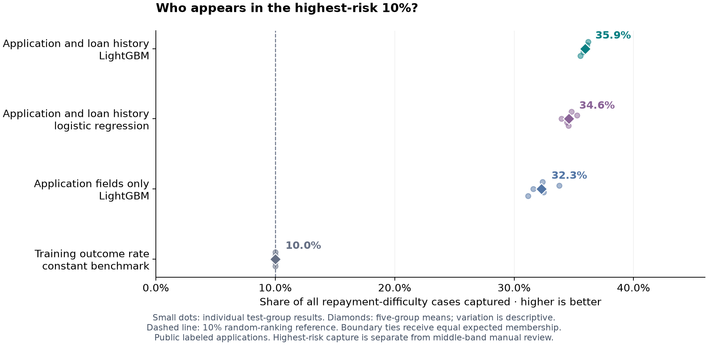
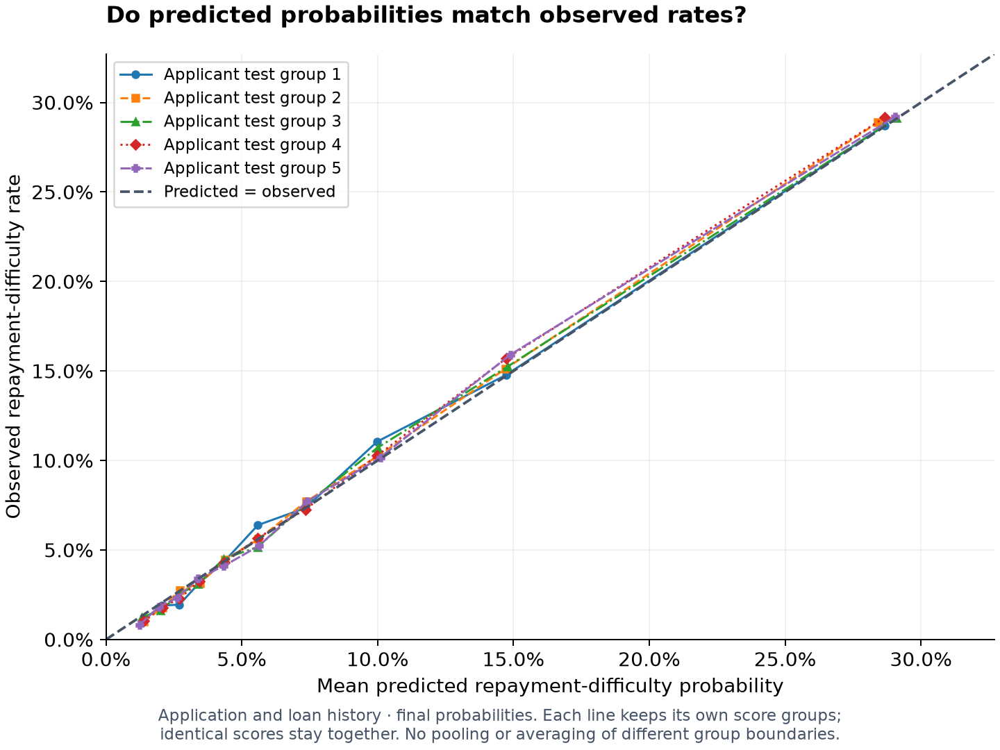
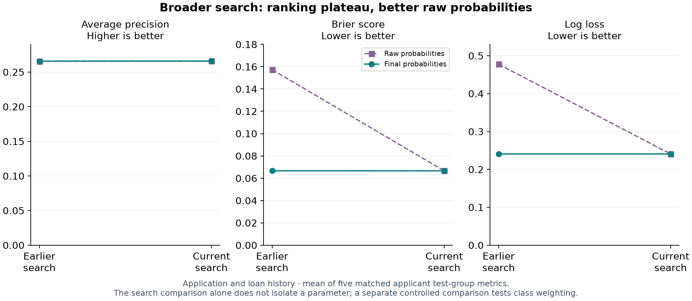
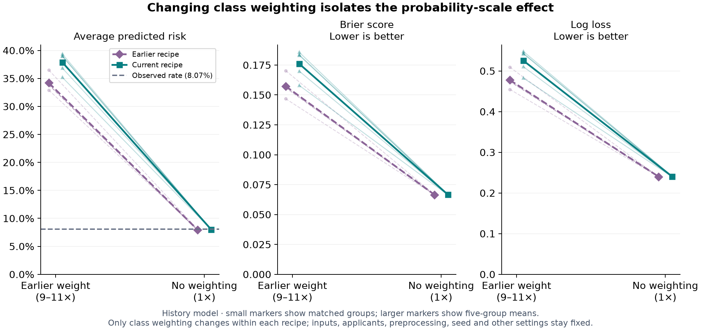
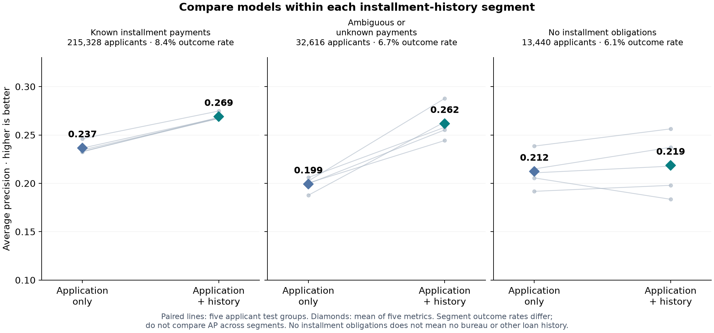
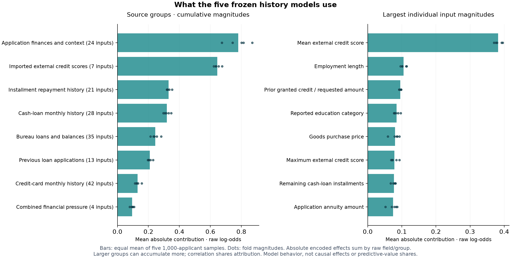
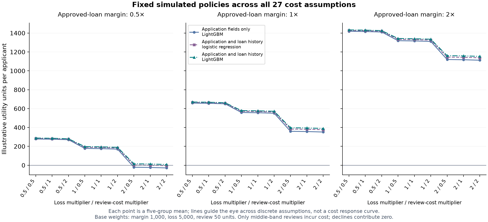

# Credit risk from application and repayment history

I built a SQL/DuckDB and Python pipeline that joins public loan and repayment tables, compares risk models, and produces an offline report.

Application and loan history reached 0.266 average precision, compared with 0.231 using application fields only.

These are means from five matched applicant test groups covering 261,384 labeled applicants. Average precision measures ranking, not accuracy. Prior exploration and random groups limit claims about future cohorts.

## The question

Loan applications contain current financial information, while separate tables record previous loans, monthly balances and repayments. This public Home Credit project asks whether joining that history improves ranking of applicants with observed repayment difficulty. The recorded target is a proxy for repayment difficulty, not measured financial loss.

## What I built

SQL builds one modeling record per applicant, separately for labeled assessment and unlabeled scoring. Installment obligations are counted once across split payments; ambiguous schedules and unknown payments remain explicit. Monthly history uses distinct applicant months, and bureau loans must originate before the application day.

Python coordinates ingestion, model selection, scoring, SHAP interpretation and exports. Identifiers, the outcome and direct demographic/protected-status-like fields are excluded from model inputs. Relative dates cannot certify when a lender could have obtained each field.

Public tables → SQL/DuckDB features → Python models → Reporting and batch scoring.

**Counting one obligation once — synthetic example.** A synthetic test records payments of 40 and 60 against one 100-unit obligation. The SQL result contains 100 units due and 100 paid, rather than counting the repeated amount due twice. The same test excludes a payment recorded after the application day. These are fixture values, not applicant records or dollars.

[Inspect the repayment fixture](https://github.com/stevennitesh/loan-default-risk-decisioning-system/blob/main/tests/test_repayment_methodology.py).

## History improves ranking in this assessment

Average precision is 0.266 with application and loan history versus 0.231 with application fields only. Average precision summarizes how strongly repayment-difficulty cases concentrate near the top of the ranking; it is not accuracy. The history model captures 35.9% of observed repayment-difficulty cases in the highest-risk 10% of applicants, against a 10% random-ranking reference. This highest-risk group is separate from the middle manual-review band.

Equal scores at the boundary receive equal expected membership; the methods retain the exact tie rule.

| Model / input scope | Average precision ↑ | ROC AUC ↑ | Brier score ↓ | Log loss ↓ |
|---|---:|---:|---:|---:|
| Training outcome rate · constant benchmark | 0.081 | 0.500 | 0.074 | 0.281 |
| Application fields only · LightGBM | 0.231 | 0.748 | 0.068 | 0.249 |
| Application and loan history · logistic regression | 0.251 | 0.767 | 0.067 | 0.244 |
| Application and loan history · LightGBM | 0.266 | 0.776 | 0.067 | 0.241 |

## Check probabilities separately

The history model's Brier score is 0.067 and log loss is 0.241; lower is better for both. These measure probability errors, while the reliability chart compares predicted and observed rates within each test group's own score bins. All five history models selected the full 174 eligible inputs and raw probabilities; no probability-adjustment transform was selected.

The 50 displayed bins contain 5,227 to 5,228 applicants each; score ties stay together. Reliability is descriptive, not a guarantee for a new lending population.

## A broader search did not materially improve ranking

The earlier corrected history search had average precision 0.265750; the current search has 0.265862. That is a practical ranking plateau in these descriptive results. Raw probability errors improved substantially, while final probability quality stayed similar. Multiple settings and search budgets changed together, so this search comparison alone cannot attribute the change to one parameter. The separate controlled comparison below tests class weighting. A 20,000-applicant shuffled-outcome diagnostic returned roughly chance ranking; it does not establish real-world field availability or erase earlier exploration.

## Test why the raw probabilities improved

Class weighting gives repayment-difficulty cases more influence during fitting. It can improve attention to a rare outcome while distorting the probability scale. The controlled comparison changes only that weight within each frozen recipe and applicant group.

Removing class weighting is the dominant explanation for the better raw probabilities in these recipes. Probability errors improved in all ten recipe/group pairs, and putting the earlier weight into the current recipe reversed the benefit. Using the earlier recipe, mean predicted risk fell from 34.2% to 7.94%, against an observed difficulty rate of 8.07%. Raw Brier score fell from 0.1573 to 0.0666; log loss improved too. Average-rate agreement alone does not prove calibration.

Earlier probability adjustment had already repaired much of the scale error, so final probability quality changed little. This retrospective check does not promote a model, establish optimal weights for future cohorts or isolate the search screen's separate selection effect.

[Controlled comparison methods and exact results](https://github.com/stevennitesh/loan-default-risk-decisioning-system/blob/main/reports/class_weighting_20261004/assessment_report.md).

## What this demonstrates—and what remains unknown

The contribution is disciplined SQL data engineering, benchmark comparison, bounded model selection, reproducible assessment and readable reporting. Historical comparisons remain an archive. Unlabeled Kaggle applications demonstrate batch scoring only and contribute no outcome metrics. Calendar application, field-availability and outcome-maturity timestamps are missing; random applicant groups cannot validate performance in a future cohort. This portfolio does not establish underwriting, compliance, fair-lending or adverse-action readiness. The saved Power BI files and screenshots are unrefreshed historical demonstrations; the current charts and offline report are separate presentation artifacts.

## Supporting evidence and methods

The sections below retain the assessment details, segment checks, model-input explanations and simulated decision assumptions.

## Compare models on the same applicants

The assessment covers 261,384 labeled development applicants in five applicant test groups. Each group is predicted by models whose fitting and selection used the other groups. A constant outcome-rate benchmark, logistic regression, application-only LightGBM and history LightGBM predict the same test applicants. Logistic regression is the simpler linear benchmark; LightGBM combines decision trees. Means summarize five separate metrics, not one pooled cross-model score.

Prior public-data exploration remains: this is not an untouched final test or a future-cohort assessment.

[How fitting, selection and assessment are separated](https://github.com/stevennitesh/loan-default-risk-decisioning-system/blob/main/docs/validation/ASSESSMENT_METHODOLOGY.md).

## Check the installment-history boundary

History improves average precision within each declared installment-history segment: known installment payments: 0.237 to 0.269; ambiguous or unknown payments: 0.199 to 0.262; no installment obligations: 0.212 to 0.219. The chart preserves matched fold variation and applicant counts. Segment prevalences differ, so average precision should be compared between models within each segment. These labels describe installment records and payment support; no installment obligations does not imply absence of bureau or other loan history. Results are descriptive, with no significance claim.

## Explain the current assessed model inputs

The five assessed history models use 174 eligible raw inputs. Mean external credit score and Employment length lead individual input magnitudes; application finances and context have the largest cumulative group magnitude. Supplied credit scores are application inputs, so the signal should not be credited entirely to engineered history.

The chart describes how these fitted models use their inputs, on the model's internal log-odds score scale. It sums absolute contributions, so a group's total depends on its input count and correlated fields. These magnitudes are not signed net effects, probability changes, causal effects or shares of predictive performance.

The diagnostic reuses the five frozen models on target-blind samples without fitting or selection. Sampling, encoded-field aggregation and separate signed additivity checks are documented in the methods download; these are not adverse-action reasons.

[Sampling and contribution methods](model_input_methods.md).

| Input group | Raw inputs | What it describes |
|---|---:|---|
| Application finances and context | 24 | Requested credit, income, annuity, financial ratios, employment and application context. Direct demographic/protected-status-like fields are excluded; remaining context can still contain proxies. |
| Imported external credit scores | 7 | Three supplied external-score fields and their mean, minimum, maximum and missing-count summaries. Their original construction and real-time availability cannot be independently certified. |
| Bureau loans and balances | 35 | Counts, amounts, debt, overdue status and relative dates for bureau loans originating before application day; monthly balance status and recent deterioration. |
| Cash-loan monthly history | 28 | Monthly loan status, days past due, remaining installments and recent/last-loan deterioration, aggregated using distinct applicant months. |
| Credit-card monthly history | 42 | Balances, limits, utilization, drawings, payment support and delinquency, with recent and last-loan summaries. |
| Installment repayment history | 21 | Payment timing, shortfalls, arrears and recent repayment behavior. Obligations are counted once across split payments; ambiguity and unknown payment support remain explicit. |
| Previous loan applications | 13 | Prior Home Credit application outcomes, requested and granted amounts, approval/refusal rates and relative decision dates. |
| Combined financial pressure | 4 | Ratios combining external scores or application income/credit with bureau debt and installment payment shortfall. These groups overlap information sources. |

## Show decisions as assumptions, not lending advice

A lower score cutoff separates simulated approval from manual review; an upper cutoff separates manual review from simulated decline. Cutoffs come from model-selection applicants and are applied unchanged to assessment applicants. Only the middle band incurs review cost. Simulated declines issue no loan and contribute zero modeled margin, loss or review cost. The example weights are 1,000 units for an approved applicant without recorded difficulty, 5,000 units of loss for an approved applicant with difficulty and 50 units per review. Utility is in illustrative units, not dollars or profit. Sensitivity checks vary each weight by 0.5, 1 and 2. No reviewer effectiveness, rejected-loan counterfactual or hard review-queue limit is estimated.

## Check sensitivity without re-optimizing policies

Application and loan history has the highest mean simulated utility among the three declared model workflows in 27 of 27 assumption combinations. Each of the three workflows keeps the score cutoffs and actions from its five applicant-group fits fixed (15 fitted policies in total); varying margin, loss and review-cost weights does not optimize a new policy. Each point is a mean of five fold utilities, not a profit estimate. The constant ranking benchmark is not part of this declared utility grid.

Only the middle manual-review band incurs review cost; simulated declines contribute zero modeled utility. These descriptive results remain conditional on the illustrative formula and public-data population.

## Metric glossary

| Measure | Meaning | Direction | Units |
|---|---|---|---|
| Average precision | Precision weighted by increases in case capture as the score cutoff changes; a ranking summary, not accuracy. | Higher is better | Unitless, 0 to 1 |
| ROC AUC | How often a repayment-difficulty case receives a higher score than a case without difficulty, with half credit for ties. | Higher is better | Unitless, 0 to 1 |
| Brier score | Mean squared difference between predicted probability and the recorded binary outcome. | Lower is better | Squared probability error |
| Log loss | Probability error that penalizes confident incorrect predictions more strongly; uses natural logarithms. | Lower is better | Unitless |
| Repayment-difficulty cases captured in highest-risk group | Share of recorded repayment-difficulty cases captured among the highest-risk fraction of applicants (10% in this assessment), using equal expected membership for boundary ties. Separate from middle-band manual review. | Higher is better at the same group size | Fraction; displayed as a percentage |
| Illustrative utility per applicant | Assumed approved-loan margins minus assumed losses and middle-band review costs, divided by applicant count. Not dollars or measured profit. | Higher only under the same assumptions | Illustrative utility units per applicant |

## Explore the evidence

- Read online: [browser report](https://stevennitesh.github.io/loan-default-risk-decisioning-system/) or [standalone offline report](index.html).
- Check the exact results: [numeric appendix](metrics.csv), [metric dictionary](metric_dictionary.csv) and [presentation provenance](provenance.json).
- Understand the model inputs: [frozen-model methods](model_input_methods.md), [input dictionary](model_input_dictionary.csv) and [input magnitudes](model_input_summary.csv).
- Read the technical assessment: [current procedure](https://github.com/stevennitesh/loan-default-risk-decisioning-system/blob/main/reports/tuning_20261004/assessment_report.md) and [controlled weighting follow-up](https://github.com/stevennitesh/loan-default-risk-decisioning-system/blob/main/reports/class_weighting_20261004/assessment_report.md).
- Follow the development trail: [historical experiment archive](https://github.com/stevennitesh/loan-default-risk-decisioning-system/blob/main/reports/experiments/README.md).

Install the dependencies using [How To Run](https://github.com/stevennitesh/loan-default-risk-decisioning-system/blob/main/README.md#how-to-run), then regenerate with `make portfolio` (Windows: `make portfolio PYTHON=python`). Only committed anonymous aggregates are read; no raw data, saved model or new fitting is required.
